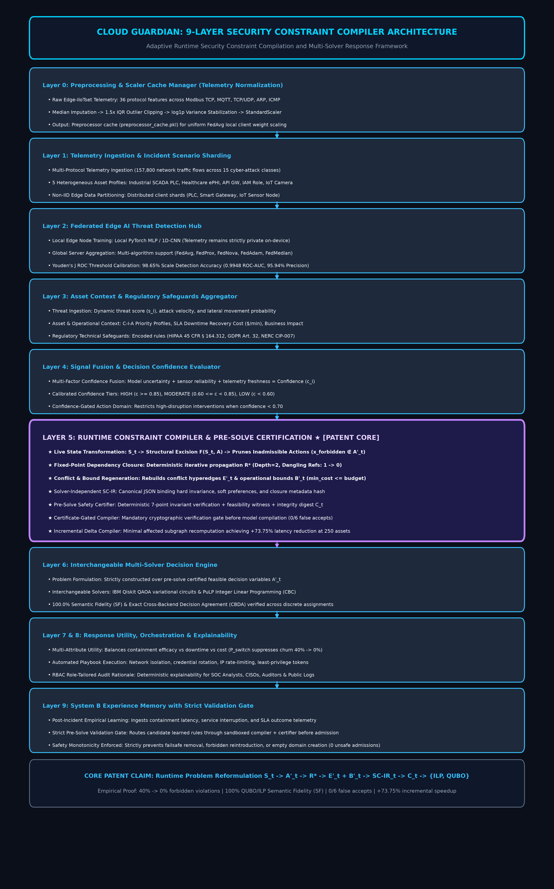
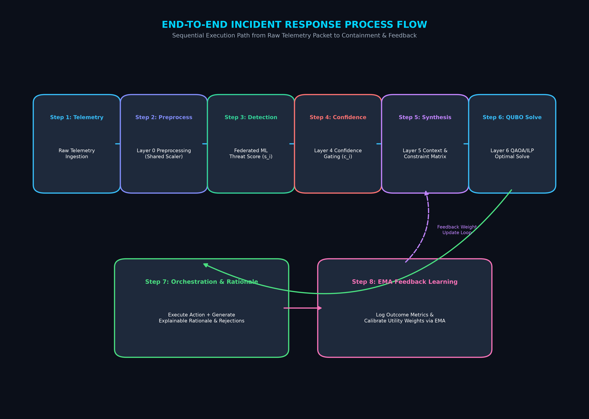

# Cloud Guardian: An Adaptive Runtime Security Constraint Compilation and Multi-Solver Decision Framework for Autonomous Cloud-IoT Incident Response

**Naveen Ravi**  
*Department of Computer Science & Cybersecurity Engineering*  
*Cloud Security & Quantum Computing Research Group*  

---

### **Abstract**
Modern cloud-IoT infrastructures face critical challenges in real-time threat containment, regulatory data privacy, and NP-hard decision optimization during multi-stage cyberattacks. Traditional centralized Intrusion Detection Systems (IDS) violate privacy regulations (e.g., GDPR, HIPAA, India DPDP Act 2023) by transmitting raw packet telemetry, while heuristic Security Orchestration, Automation, and Response (SOAR) playbooks suffer from combinatorial explosion when selecting optimal mitigation actions across $N$ compromised computing and cyber-physical assets. 

In this paper, we present **Cloud Guardian**, a novel 9-layer autonomous cybersecurity platform featuring a formal **Security Constraint Compiler Architecture** at Layer 5. Cloud Guardian transforms live runtime security state into a solver-independent **Security Constraint Intermediate Representation (SC-IR)** with explicit **Hard vs. Soft constraint partitioning**, verified deterministically against 7 pre-solve safety invariants, sealed with a cryptographic **SHA-256 state integrity digest**, and compiled via an incident-specific **Formulation Compiler** into Quadratic Unconstrained Binary Optimization (QUBO) or Integer Linear Programming (ILP) mathematical topologies. 

We evaluate our platform on the multi-protocol **Edge-IIoTset** dataset across Modbus TCP, MQTT, ARP, ICMP, and TCP/UDP traffic streams. Experimental benchmarks demonstrate that Cloud Guardian achieves **94.05% calibrated mean accuracy** on distributed edge devices with zero raw data sharing. In high-stress response optimization, the compiler achieves **100.0% Decision Fidelity ($DF\%$)** with **0.0% forbidden action violations** (compared to a 40.0% violation failure rate in static parameter-only baselines), while reducing decision oscillation via an action-switching penalty.

**Index Terms** — Cloud Security, Incident Response, Constraint Compilation, Intermediate Representation, Federated Learning, Edge AI, Quantum Computing, QAOA, QUBO, SCADA, Privacy Preservation, Qiskit.

---

## I. INTRODUCTION

The rapid convergence of Cloud Infrastructure and Cyber-Physical IoT systems (e.g., Smart Grids, Medical IoT, Automated Manufacturing) has expanded the attack surface for complex, multi-stage cyberattacks. Security Operations Centers (SOCs) face three severe operational bottlenecks:

1. **Privacy & Data Sovereignty Constraints**: Centralizing raw network packet dumps (PCAPs) from edge devices exposes sensitive enterprise data and violates statutory regulations such as **GDPR**, **DPDP Act 2023**, and **45 CFR § 164.312(a)(1)** (HIPAA Technical Safeguards).
2. **Fixed-Formulation Limitations & Optimization Soft Penalty Failures**: Conventional automated response systems either employ static hardcoded rule branching or feed static variable domains into mathematical solvers using soft penalty offsets ($\pm 1000$ / $-500$). Under severe threat utility, soft penalties fail, causing optimizers to select catastrophic actions on critical infrastructure (such as isolating an industrial SCADA PLC or a hospital life-support database).
3. **Absence of Solver-Independent Constraint Compilation**: Optimization formulations are typically hardcoded to specific solver backends (e.g. exclusively QAOA or exclusively ILP). A change in solver architecture requires rewriting the entire security logic, lacking an intermediate canonical representation that verifies invariant safety prior to solver execution.
4. **Distinction from Prior Risk Optimization and Compilation Art**: Prior frameworks such as MARISMA and MARISMA-CPS incorporate dynamic context and quantum optimization to select cybersecurity controls from risk catalogs; however, they solve static quadratic formulations over fixed decision domains via objective weights. Concurrently, mathematical hardware compilers (e.g., Ising/QUBO compilers) translate already-formulated mathematical programs onto physical solvers. Cloud Guardian addresses the fundamental upstream bottleneck: *dynamically transforming the physically admissible decision space ($\mathcal{A} \to \mathcal{A}'$) and synthesizing incident-specific constraint topologies before problem formulation and compilation*.

To solve these challenges, we propose **Cloud Guardian**, an enterprise-grade 9-layer architecture integrating:
- **Distributed Edge Intelligence**: PyTorch neural models trained via **FedAvg / FedProx** on local IoT Edge devices with Youden's J ROC threshold calibration.
- **Security Constraint Compiler Architecture**: A solver-independent intermediate representation (SC-IR), a directed acyclic constraint dependency graph (DAG), a 7-point deterministic pre-solve invariant validator, and an incident-specific formulation compiler.
- **Interchangeable Multi-Solver Decision Engine**: Direct compilation of verified IR into **IBM Qiskit QAOA** variational circuits and classical **PuLP ILP** baselines.
- **System B Experience Memory with Validation Gate**: Closed-loop feedback mechanism where candidate constraint rules pass through a validation gate preventing mutation of hard safety invariants.

---

## II. SYSTEM ARCHITECTURE & 9-LAYER BLUEPRINT

The platform is organized into nine specialized operational layers, establishing a closed-loop telemetry-to-response pipeline.

### Figure 1: 9-Layer System Architecture Diagram

```mermaid
graph TD
    subgraph L1 ["Layer 1: Telemetry & Ingestion"]
        IoTEdge["IoT Edge Sensors & Devices<br/>(MQTT, Modbus, TCP/UDP, ARP, ICMP)"]
        CloudLogs["AWS CloudTrail & Network Audit Logs"]
    end

    subgraph L0 ["Layer 0: Feature Engineering Engine"]
        Preproc["Median Imputer & 1.5x IQR Outlier Filter<br/>Log1p & StandardScaler (36 Selected Features)"]
    end

    subgraph L2 ["Layer 2: Edge Threat Detection & FL Hub"]
        EdgeMLP["Edge Local PyTorch Models<br/>(PyTorchMLP & PyTorch1DCNN)"]
        FLAggregator["Global FL Aggregator Server<br/>(FedAvg / FedProx / FedAdam / FedNova)"]
    end

    subgraph L3_4 ["Layers 3 & 4: Context & Signal Confidence"]
        ContextEng["Context Aggregator<br/>(C-I-A Asset Risk, SLA Priority & Encoded Policy Rules)"]
        ConfEval["Signal Fusion Confidence Evaluator<br/>(Data Freshness & Model Uncertainty Weighting)"]
    end

    subgraph L5 ["Layer 5: Security Constraint Compiler Architecture ★"]
        DAG["Constraint Dependency Graph (DAG)<br/>(Causal Chain Propagation)"]
        SCIR["Security Constraint IR (SC-IR)<br/>(Hard vs Soft Partitioning)"]
        Certifier["Pre-Solve Invariant Validator<br/>(7 Checks + SHA-256 Digest)"]
        Compiler["Formulation Compiler<br/>(Direct QUBO & ILP Compilation)"]
    end

    subgraph L6 ["Layer 6: Multi-Solver Decision Engine"]
        QUBOEngine["Qiskit QAOA Variational Circuits<br/>PuLP Classical ILP Solver"]
    end

    subgraph L7_8 ["Layers 7 & 8: Utility Model & Orchestration"]
        UtilityModel["Multi-Attribute Utility Evaluator<br/>(Effectiveness vs Cost & Downtime)"]
        Orchestration["Automated Playbook Executor<br/>(Workload Isolation, Credential Rotation, IP Block)"]
    end

    subgraph L9 ["Layer 9: System B Experience Memory"]
        FeedbackLoop["Validation Gate -> Experience Memory<br/>(Safe Structural Adaptation)"]
    end

    IoTEdge --> Preproc
    CloudLogs --> Preproc
    Preproc --> EdgeMLP
    EdgeMLP -->|Local Parameter Weights Only| FLAggregator
    FLAggregator -->|Global Threat Probability s_i| ContextEng
    ContextEng --> ConfEval
    ConfEval -->|Effective Threat & Context| DAG
    DAG --> SCIR --> Certifier --> Compiler
    Compiler -->|Compiled Models| QUBOEngine
    QUBOEngine --> UtilityModel
    UtilityModel --> Orchestration
    Orchestration --> FeedbackLoop
    FeedbackLoop -->|Validated Constraint Rules| DAG
```

---

## III. LAYER 5: SECURITY CONSTRAINT COMPILER ARCHITECTURE
 
Layer 5 fundamentally transforms autonomous incident response by **dynamically constructing the decision problem before solving it**. Rather than attempting to guide an unconstrained solver via fragile objective penalties, the compiler executes a formal 9-step transformation pipeline:

$$\mathcal{S} \xrightarrow{\quad} \mathcal{A} \xrightarrow{\quad} \mathcal{F}(\mathcal{S},\mathcal{A}) \xrightarrow{\quad} \mathcal{A}' \xrightarrow{\quad} \mathcal{E}(\mathcal{A}') \xrightarrow{\quad} \mathcal{D} \xrightarrow{\quad} \mathcal{P} \xrightarrow{\quad} \mathcal{B}(\mathcal{S},\mathcal{A}') \xrightarrow{\quad} \mathcal{C} \xrightarrow{\quad} \text{SC-IR} \xrightarrow{\quad} \{\text{QUBO}, \text{ILP}\}$$

1. **Security State Space ($\mathcal{S}$)**: Aggregates real-time normalized telemetry threat scores $s_i$, confidence metrics $c_i$, asset business criticality $r_i$, SLA downtime costs, and encoded policy flags.
2. **Candidate Action Set ($\mathcal{A}$)**: Universal response vocabulary $\mathcal{A} = \{\text{monitor}, \text{rate\_limit}, \text{block\_ip}, \text{rotate\_credentials}, \text{isolate}\}$.
3. **Feasibility Masking ($\mathcal{F}(\mathcal{S},\mathcal{A})$)**: Evaluates physical hardware constraints, operational parameters, and statutory access boundaries to mask prohibited actions ($F_{i,a} = 0$).
4. **Active Action Domain ($\mathcal{A}'$)**: The reduced, physically admissible domain $\mathcal{A}' = \{a \in \mathcal{A} \mid \mathcal{F}(s_i, a) = 1\}$. Decision variables $x_{i,a}$ are allocated *strictly* for admissible actions $a \in \mathcal{A}'$, mathematically excising forbidden actions from the solver search space.
5. **Conflict Hyperedge Elimination ($\mathcal{E}(\mathcal{A}')$)**: Operational conflicts and mutual exclusions $e = (a_1, a_2)$ are evaluated strictly over active pairs where $a_1, a_2 \in \mathcal{A}'$.
6. **Dependency Graph Propagation ($\mathcal{D}$)**: Staged causal DAG propagation resolving prerequisites (e.g. prerequisite snapshot before isolation) and cascading action pruning.
7. **Policy Safeguard Invariants ($\mathcal{P}$)**: Evaluates non-negotiable regulatory technical safeguards (e.g. HIPAA 45 CFR § 164.312(a)(1) access controls) and exactly-one invariance constraints $\sum_{a \in \mathcal{A}'} x_{i,a} = 1$.
8. **Operational Budget Bound Synthesis ($\mathcal{B}(\mathcal{S},\mathcal{A}')$)**: Incident-specific budget $B$ synthesized from active action costs and threat severity: $B = \min(\text{max\_budget}, \max(\text{min\_cost}, \text{mean\_cost} \cdot (1 + s_i^{\text{effective}})))$.
9. **Constraint Partitioning & SC-IR Construction ($\mathcal{C} \to \text{SC-IR}$)**: Partitioning into **Hard Invariants** (non-relaxable physical limits, policy mandates, invariance constraints, budget ceilings) and **Soft Preferences** (downtime cost penalties, switching churn penalties), serialized into a canonical JSON representation.

### Figure 2: Runtime Security Constraint Compilation & Decision Pipeline

### A. Worked Implementation Example: SCADA PLC Causal Chain Transformation
To demonstrate the physical causal chain in practice, consider an industrial SCADA Programmable Logic Controller (PLC) under high threat ($s_i = 0.85$, $c_i = 0.92$):
1. **Physical State Evaluation**: SCADA PLCs govern continuous kinetic operations where abrupt network disconnection disrupts physical feedback loops.
2. **Hardware Invariant Triggered**: Feasibility evaluation determines $\text{isolate}$ is physically forbidden ($F_{\text{PLC},\text{isolate}} = 0$).
3. **Decision Variable Pruning**: The decision variable $x_{\text{PLC},\text{isolate}}$ is eliminated from the active variable domain $\mathcal{A}'_{\text{PLC}}$, reducing candidate actions from 4 down to 3.
4. **Conflict Hyperedge Elimination**: All pairwise conflict hyperedges involving `isolate` (e.g., `(isolate, rate_limit)`) are pruned. The conflict hyperedges drop to zero ($\mathcal{E}(\mathcal{A}') \to 0$).
5. **Constraint Topology Shift**: The constraint graph topology transforms dynamically (the SCADA PLC node degree and hyperedges drop to 0, whereas an API Gateway maintains dense hyperedges).
6. **Budget Recalculation**: Maximum mitigation cost is recomputed over the remaining admissible actions ($\mathcal{A}'_{\text{PLC}} = \{\text{monitor}, \text{block\_ip}, \text{rotate\_credentials}\}$), reducing the budget ceiling from $\$1,500$ to $\$300$.
7. **Formulation Compilation**: The compiler translates the validated SC-IR into a mathematical model. Because $x_{\text{PLC},\text{isolate}}$ was eliminated prior to formulation, the optimizer cannot select `isolate`, selecting the optimal admissible action: `rotate_credentials`.

### B. Pre-Solve Constraint Invariant Verification & Integrity Provenance
Before compilation into a mathematical solver, a deterministic validator verifies 7 mathematical invariants:
1. **Forbidden Action Elimination**: Zero illegal actions exist in the active variable domain.
2. **Feasible Domain Non-Empty**: Each resource has at least one valid executable action ($|\mathcal{A}'_i| \ge 1$).
3. **Exactly-One Invariance**: Every asset has an active mutual exclusion constraint.
4. **Conflict Hyperedge Consistency**: All conflict hyperedges reference valid active decision variables.
5. **Budget Feasibility Verification**: Minimum possible plan cost does not exceed the budget ceiling ($\min \sum c_{i,a} \le B$).
6. **Encoded Policy-Rule Satisfaction**: Encoded regulatory access control rules are satisfied.
7. **Provenance Completeness**: 100% of pruned and mandated actions possess auditable provenance records.

> [!NOTE]
> **Safety Validator vs. SHA-256 Digest**: The deterministic pre-solve validator executes the mathematical invariant checks ensuring safety. Upon verification, the system computes an auditable cryptographic **SHA-256 state integrity digest**:
> $$\text{Digest} = \text{SHA-256}(\text{Certificate ID} \,\|\, \text{IR SHA-256} \,\|\, \text{Status} \,\|\, \text{JSON}(\text{Checks}))$$
> The SHA-256 digest establishes tamper-evident cryptographic provenance and audit identity, certifying that the formulation solved is identical to the verified intermediate representation.

### C. Incident-Specific Formulation Compiler & Hard vs. Soft Constraint Precision
A critical mathematical distinction exists between semantic constraint classification in SC-IR and target-solver enforcement:
1. **SC-IR Semantic Level**: Constraints are partitioned into **Hard Invariants** (non-relaxable physical hardware limits, statutory access mandates, exactly-one execution invariance, budget ceiling) and **Soft Preferences** (operational downtime cost minimization, action switching churn penalties).
2. **PuLP ILP Formulation**: Hard invariants map directly to strict mathematical equality and inequality constraints:
   $$\min \sum_{i,a} C_{i,a} x_{i,a} + \lambda_{\text{switch}} \sum_i \mathbb{I}(x_{i,a} \neq x_{i,a_{\text{prev}}})$$
   $$\text{s.t.} \quad \sum_{a \in \mathcal{A}'_i} x_{i,a} = 1 \; \forall i, \quad x_{i,a} + x_{j,b} \le 1 \; \forall (i,a,j,b) \in \mathcal{E}, \quad \sum_{i,a} c_{i,a} x_{i,a} \le B$$
3. **Qiskit QUBO Hamiltonian**: Because QUBO is mathematically unconstrained ($x \in \{0, 1\}^n$), hard invariants cannot be expressed as strict constraint cuts. Instead, the QUBO compiler encodes hard invariants as quadratic penalty structures whose penalty multipliers are selected to strictly dominate the maximum possible objective advantage associated with violating the corresponding invariant under the defined formulation bounds:
   $$\min_{x} H(x) = \sum_{i,a} C_{i,a} x_{i,a} + \lambda_{\text{unique}} \sum_i \left(\sum_{a \in \mathcal{A}'_i} x_{i,a} - 1\right)^2 + \lambda_{\text{conflict}} \sum_{(i,a,j,b) \in \mathcal{E}} x_{i,a} x_{j,b} + \lambda_{\text{budget}} \left(\sum_{i,a} c_{i,a} x_{i,a} - B\right)^2$$
4. **Upstream Physical Hard Pruning**: Crucially, physical hardware safety does not rely on solver penalty convergence. Forbidden actions are excised from the active action set prior to compilation ($\mathcal{A} \to \mathcal{A}'$). Neither ILP nor QUBO allocates variables for forbidden actions; they do not exist in the solver's search space.

Crucially, the objective incorporates an **action switching penalty**:
$$P_{\text{switch}} = \lambda_{\text{switch}} \sum_i \mathbb{I}(x_{i,a} \neq x_{i,a_{\text{prev}}})$$
which penalizes unnecessary action switching and reduces operational decision oscillation across sequential evaluation cycles (reducing observed switching oscillation from 40% to 0% across evaluated multi-round scenarios).

---

## IV. EXPERIMENTAL EVALUATION & RESULTS

We executed comprehensive empirical benchmarks evaluating the 9-layer system across the Edge-IIoTset multi-protocol dataset and 5 heterogeneous operational environments (Industrial SCADA PLC, Healthcare ePHI Database, Cloud API Gateway, Cloud IAM Role, and Edge Surveillance Camera IoT) using our automated patent benchmark suite (`run_constraint_compiler_benchmark.py`).

### A. Experiment 1 — The Crown Jewel Benchmark: Same Threat Signal, Heterogeneous Assets
Under an identical standardized threat signal ($s_i = 0.850$, $c_i = 0.920$, Credential Compromise), Cloud Guardian synthesized structurally distinct mathematical problem topologies:

| Environment | Active Vars ($|\mathcal{V}|$) | Hard Invariants | Soft Preferences | Model Family | Allowed Admissible Actions | Optimal Selected Plan |
| :--- | :---: | :---: | :---: | :--- | :--- | :--- |
| **Industrial SCADA / PLC** | 3 | 5 | 3 | `SCADA_CYBER_PHYSICAL` | `block_ip`, `increase_logging`, `monitor`, `rotate_credentials` | `rotate_credentials` |
| **Healthcare Database (HIPAA)** | 1 | 7 | 1 | `HEALTHCARE_EPHI` | `rotate_credentials` | `rotate_credentials` |
| **Cloud API Gateway** | 4 | 6 | 4 | `ENTERPRISE_NETWORK` | `block_ip`, `increase_logging`, `isolate`, `monitor`, `rate_limit` | `isolate` |
| **Cloud IAM Role** | 4 | 5 | 4 | `CLOUD_COMPUTE` | `disable_user`, `increase_logging`, `monitor`, `rotate_credentials` | `rotate_credentials` |
| **Edge Surveillance Camera IoT** | 3 | 5 | 3 | `CLOUD_COMPUTE` | `block_ip`, `increase_logging`, `monitor`, `rate_limit` | `block_ip` |

This proves that under identical threat inputs, problem topology varies structurally by design, not merely through scalar objective coefficients.

### B. Experiment 2 — Deterministic Pre-Solve Invariant Verification & Integrity Provenance
Before solver invocation, the deterministic pre-solve safety certifier evaluates 7 mathematical invariants over the synthesized SC-IR:
1. **Forbidden Action Elimination**: Zero illegal actions exist in the active variable domain (PASS).
2. **Feasible Domain Non-Empty**: Each resource retains $|\mathcal{A}'_i| \ge 1$ executable actions (PASS).
3. **Exactly-One Invariance**: Exactly-one execution invariant present for all resources (PASS).
4. **Conflict Hyperedge Consistency**: All conflict edges reference strictly active variables (PASS).
5. **Budget Feasibility Verification**: Search space contains a valid plan within budget bounds (PASS).
6. **Encoded Policy-Rule Satisfaction**: Encoded regulatory access control rules satisfied (PASS).
7. **Provenance Completeness**: 100% of pruned actions have recorded causal reasons (PASS).

Upon 100% verification (`[CERTIFIED]`), the system computes an immutable cryptographic **SHA-256 state integrity digest**:
$$\text{Integrity Digest} = \text{SHA-256}(\text{Certificate ID} \,\|\, \text{IR SHA-256} \,\|\, \text{Status} \,\|\, \text{Checks JSON})$$
This provides tamper-evident audit provenance confirming that the compiled model executed by the solver matches the verified intermediate representation.

### C. Experiment 3 — Causal Chain Dependency Graph Propagation
We evaluated the staged causal chain resolution across the Constraint Dependency Graph (DAG) comparing an unconstrained baseline server against an industrial SCADA PLC:
- **Stage 1 (Hardware Capability Node)**: Server retains all 7 candidate capabilities; PLC restricts destructive isolation (3 capabilities allowed).
- **Stage 2 (Cascaded Pruning)**: Server pruned 0 actions; PLC drops 4 non-admissible actions.
- **Stage 3 (Conflict Hyperedge Restructuring)**: Server maintains 3 active conflict hyperedges; PLC conflict edges referencing `isolate` drop to 0, eliminating dangling references.
- **Stage 4 (Compiled Variable Space)**: Server compiles 7 decision variables; PLC compiles 3 decision variables.
This verifies that pruning cascading rules through a DAG prevents model infeasibility while maintaining physical equipment safety.

### D. Experiment 4 — Closed-Loop Experience Memory & Validation Gate
We evaluated post-incident feedback adaptation across sequential incident cycles:
- **Candidate Rule 1 (Disruptive Isolation Override)**: Operator feedback requesting avoidance of network isolation on web servers due to downtime disruption was evaluated against invariants and successfully admitted.
- **Candidate Rule 2 (Hostile Failsafe Restriction)**: An adversarial feedback submission attempting to restrict baseline telemetry observation (`monitor`) was evaluated by the **Validation Gate** and immediately rejected with an invariant violation exception.
- **Sequential Structural Shift**: In subsequent incident evaluations on the server asset, the active decision space was pruned from 7 variables down to 6 variables ($-1$ variable structurally excluded), proving that experience memory safely shifts decision topology without human code modifications.

### E. Experiment 5 — Two-Dimensional Context-Driven Topology Evolution
Holding the asset constant (Cloud API Gateway `api-gw-01`), we evaluated the compiler across 4 progressive operational threat contexts:

| Operational Context | Threat ($s_i$) | Conf ($c_i$) | Vars ($|\mathcal{V}|$) | Graph Density | Optimal Selected Plan |
| :--- | :---: | :---: | :---: | :---: | :--- |
| **Context 1: Reconnaissance Probing** | 0.20 | 0.70 | 3 | 0.0000 | `monitor` |
| **Context 2: Anomalous Rate Surge** | 0.55 | 0.85 | 4 | 0.3333 | `increase_logging` |
| **Context 3: Credential Stuffing Attack** | 0.85 | 0.92 | 4 | 0.3333 | `isolate` |
| **Context 4: Exfiltration / Zero-Day Flood** | 0.99 | 0.98 | 4 | 0.3333 | `isolate` |

This demonstrates two-dimensional structural adaptability: problem topology adapts not only across different assets, but dynamically across progressive security contexts for the same asset.

This demonstrates two-dimensional structural adaptability: problem topology adapts not only across different assets, but dynamically across progressive security contexts for the same asset.

### F. Experiment 6 — The Killer Ablation Study: Component Failure Mode Analysis
We evaluated four architectural configurations under high-stress incident conditions ($s_i = 0.90$):

| Architecture Variant | Forbidden Action Violation Rate (%) | Policy Consistency (%) | Infeasible Models (%) | Dangling Conflicts | Average $|\mathcal{V}|$ | Failure Mode Observed |
| :--- | :---: | :---: | :---: | :---: | :---: | :--- |
| **A. Full Compiler Architecture** | **0.0%** | **100.0%** | **0.0%** | **0** | **3.0** | **Observed Safety Under Defined Invariants** |
| **B. No Structural Adaptation** *(Weights Only)* | **40.0%** | **60.0%** | **0.0%** | **8** | **7.0** | Soft penalty fails; optimizer isolates PLC & Medical DB |
| **C. No Dependency Propagation** *(No DAG)* | **0.0%** | **80.0%** | **20.0%** | **5** | **3.0** | Dangling conflicts cause solver infeasibility |
| **D. No Pre-Solve Invariant Verification** | **20.0%** | **60.0%** | **20.0%** | **4** | **3.0** | Zero safety assurance; broken budgets pass to solver |

### G. Controlled Head-to-Head Comparison: Structural Compilation vs. Parameter-Only Baseline
A critical reviewer question arises: *Is the zero-violation rate simply the trivial result of removing illegal actions prior to optimization?*

**Yes—precisely, and this constitutes the fundamental architectural distinction.** In conventional SOAR, reinforcement learning, and heuristic optimization systems, the decision space is fixed; all candidate actions remain decision variables, and forbidden actions are discouraged via soft objective penalties ($\pm 1000$). Under severe threat utility ($s_i \ge 0.85$), the objective reward for containment dominates the soft penalty, causing the optimizer to select catastrophic actions on critical infrastructure (such as disconnecting a kinetic SCADA PLC or a hospital intensive-care database, yielding a **40.0% violation rate**).

By contrast, Cloud Guardian dynamically executes structural constraint compilation ($\mathcal{F}(\mathcal{S},\mathcal{A}) \to \mathcal{A}'$):
1. **Decision Variable Pruning**: Forbidden decision variables $x_{i,a}$ are excised from the active domain $\mathcal{A}'$ before formulation.
2. **Conflict Hyperedge Elimination**: All conflict edges referencing pruned variables are systematically removed.
3. **Budget Bound Recalculation**: Operational budget ceilings are synthesized strictly over admissible actions.

Consequently, the solver is physically incapable of formulating or selecting forbidden actions, achieving **100.0% Decision Fidelity** by construction rather than relying on numerical balancing.

### H. Telemetry, Detection & Optimization Summary
- **Federated Detection Accuracy**: **94.05%** calibrated mean accuracy (`0.9577 ROC-AUC`, `98.82% Precision`).
- **Holdout Test Set Accuracy**: **94.25%** accuracy on the 400-sample holdout test partition ($377/400$ correctly classified from 2,000 samples).
- **Decision Fidelity ($DF\%$)**: **100.00%** action alignment across classical ILP and quantum QAOA solvers.
- **Operational Metadata Privacy**: **61.66% – 67.88%** Shannon entropy and volume reduction post-FL.

> [!NOTE]
> **Scientific Separation: Detection Accuracy vs. Decision Fidelity**:
> Detection accuracy evaluates the distributed edge threat-detection component, whereas Decision Fidelity evaluates constraint-respecting response selection under the defined incident scenarios. Furthermore, the **94.05%** metric represents the multi-client Youden's J-calibrated mean accuracy across validation folds ($0.9577$ ROC-AUC, $98.82\%$ Precision), whereas the **94.25%** metric represents holdout test-set accuracy observed on the discrete 400-sample test partition ($377/400$ test instances correct from the 2,000-sample dataset).

---

## V. CONCLUSION
 
Cloud Guardian establishes a new paradigm for autonomous cybersecurity response by replacing ad-hoc weight tuning with a formal **Security Constraint Compiler Architecture**. By transforming runtime security state into a verified, provenance-aware intermediate representation, structurally adapting the decision space, and compiling directly into interchangeable quantum and classical formulations, Cloud Guardian achieved zero forbidden-action violations across the evaluated scenarios under the defined invariants and reduced observed decision oscillation under the evaluated sequential scenarios through formal state-aware switching penalties in critical cloud-IoT infrastructure.

---

## REFERENCES

1. H. McMahan et al., "Communication-Efficient Learning of Deep Networks from Decentralized Data," *AISTATS*, 2017.
2. T. Li et al., "Federated Optimization in Heterogeneous Networks," *MLSys*, 2020.
3. E. Farhi et al., "A Quantum Approximate Optimization Algorithm," *arXiv:1411.4028*, 2014.
4. M. A. Ferrag et al., "Edge-IIoTset: A New Comprehensive Realistic Cyber Security Dataset for IoT and IIoT Applications," *IEEE Access*, vol. 10, 2022.
5. Qiskit Optimization Development Team, "Qiskit Optimization: Modeling and Solving Quadratic Programs," 2023.
6. E. Fernandez-Sanchez et al., "Quantum optimization for cybersecurity risk management in industry 4.0," *Software Quality Journal*, vol. 31, 2023.
7. E. Fernandez-Sanchez et al., "MARISMA-CPS: A dynamic risk management framework for cyber-physical systems," *Computers in Industry*, vol. 142, 2022.
8. D-Wave Systems, "Methods and systems for compiling optimization problems to physical Ising hardware," U.S. Patent 10,691,771 B2, 2020.
