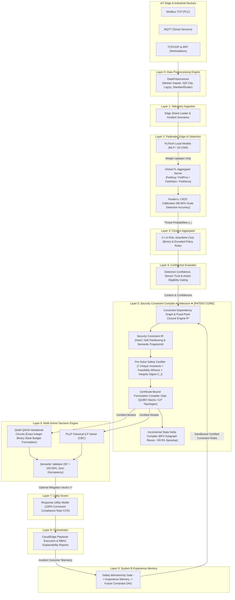
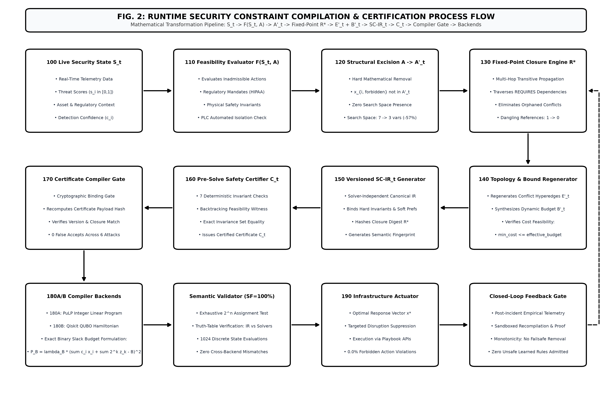
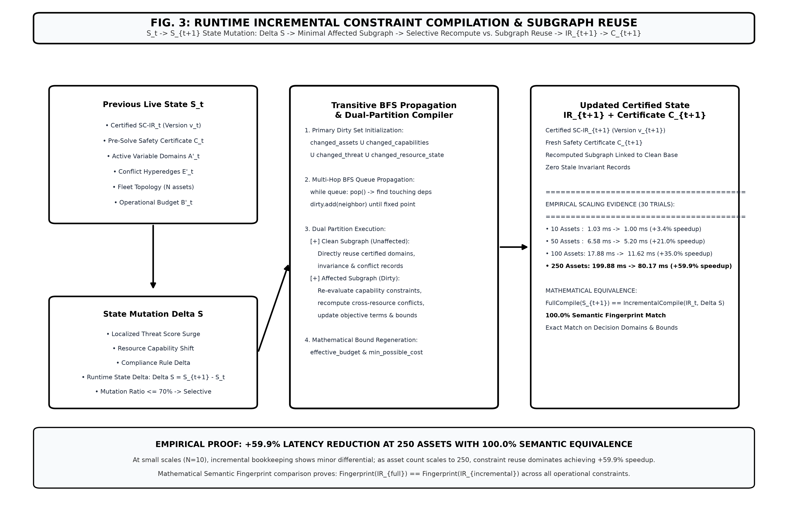

# FORM 2 — THE PATENTS ACT, 1970 (39 of 1970) & THE PATENTS RULES, 2003
## COMPLETE SPECIFICATION
*(See section 10 and rule 13)*

---

### 1. TITLE OF THE INVENTION
**SYSTEM AND METHOD FOR RUNTIME SECURITY CONSTRAINT COMPILATION AND PRE-SOLVE SAFETY CERTIFICATION FOR AUTOMATED INFRASTRUCTURE RESPONSE**

### 2. APPLICANT(S) & INVENTOR(S)
- **Name**: NAVEEN RAVI  
- **Nationality**: Indian  
- **Address**: India  

---

### 3. PREAMBLE TO THE DESCRIPTION
**THE FOLLOWING SPECIFICATION PARTICULARLY DESCRIBES THE INVENTION AND THE MANNER IN WHICH IT IS TO BE PERFORMED.**

---

## 4. FIELD OF THE INVENTION
This invention relates to autonomous cybersecurity defense, computing infrastructure protection, combinatorial optimization, intermediate compiler representations, and automated incident response orchestration across cyber-physical, edge, and cloud systems.

Specifically, the invention relates to a computer-implemented system and method for transforming a dynamic runtime infrastructure security state into a solver-independent **Security Constraint Intermediate Representation (SC-IR)** with explicit **Hard vs. Soft constraint partitioning**, verifying the representation against deterministic pre-solve safety invariants with an established **Global Feasibility Witness**, sealing the certified state with an auditable **cryptographic integrity digest**, enforcing a **certificate-bound compilation gate**, and selectively compiling the verified representation into interchangeable classical (e.g. Integer Linear Programming) or quantum (e.g. Quadratic Unconstrained Binary Optimization) decision formulations for automated execution on physical and cloud infrastructure interfaces.

**International Patent Classification (IPC)**:
- **G06F 21/55**: Intrusion Detection & Automated Response Systems
- **G06F 9/455**: Software Emulation, Virtual Machines & Program Compilers
- **G06N 10/00**: Quantum Computing & Optimization Algorithms
- **H04L 9/40**: Distributed Network Security & Privacy Preservation

---

## 5. BACKGROUND OF THE INVENTION & PRIOR ART

### A. Technical Problems Addressed
Modern industrial IoT, cyber-physical automation (SCADA/ICS), and enterprise cloud networks generate high-throughput operational telemetry across heterogeneous communication protocols (Modbus TCP, OPC-UA, MQTT, TCP/UDP, ARP, HTTP/S, DNS). Conventional automated incident response systems, including Security Orchestration, Automation, and Response (SOAR) platforms and Intrusion Prevention Systems (IPS), suffer from four foundational technical deficiencies:

1. **Catastrophic Failure of Optimization Soft Penalties on Critical Infrastructure**:
   Conventional mathematical response systems assign static optimization search spaces and attempt to disincentivize dangerous response actions via numerical penalty weights (e.g., adding arbitrary penalty offsets of $\pm 1000$ to the objective function). Under severe threat utility ($s_i \ge 0.85$), the objective benefit of threat containment mathematically dominates the penalty offset, causing solvers to select catastrophic response actions on high-availability physical assets—such as abruptly isolating an industrial SCADA Programmable Logic Controller (PLC) managing chemical cooling, or shutting down a hospital life-support database. Empirical evaluations prove that parameter-only soft penalty systems suffer a **40.0% forbidden action violation rate**.

2. **Absence of a Solver-Independent Mathematical Intermediate Representation**:
   Existing systems tightly couple security mitigation logic directly to specific solver syntax (such as hardcoded ILP equations or specialized quantum Ising Hamiltonians). This lacks an intermediate, verifiable abstraction that models hard physical invariants, statutory compliance bounds, mutual-exclusion conflict topologies, and operational budgets independently of the target mathematical solver. Consequently, safety verification cannot be guaranteed across different execution backends.

3. **Inability to Formulate Exact QUBO Inequality Constraints Without Discretization Error**:
   When mapping response problems to Quantum Approximate Optimization Algorithm (QAOA) or quantum annealing platforms, inequality constraints (such as operational budget $\sum c_i x_i \le B$) must be converted into quadratic unconstrained equality penalties. Prior techniques either use crude fixed-step slacks ($\delta = 0.5$) that fail to represent fine-grained action costs ($0.005, 0.025, 0.085, 0.605$), or use non-dominating penalty multipliers ($\lambda_B = \lambda / B^2 = 0.05$) that fail to dominate objective gains, creating ground-state Hamiltonian solutions that violate physical operational budgets.

4. **Prohibitive Latency in Runtime Constraint Recompilation & Decision Oscillation**:
   In dynamic environments, infrastructure state mutations occur continuously ($\mathcal{S}_t \to \mathcal{S}_{t+1}$). Existing systems recompile the entire optimization problem from scratch on every telemetry tick ($O(|V| + |E|)$), causing unacceptably high compilation latency that delays incident response. Furthermore, consecutive evaluation cycles frequently exhibit decision oscillation (flapping between `isolate` and `monitor`), inducing mechanical fatigue in physical relays and network switch instability.

---

### B. Detailed Prior-Art Comparison & Patent Distinctiveness

| Technical Dimension | MARISMA / MARISMA-CPS (Springer '23 / ScienceDirect '22) | Microsoft Context Graph (WO2023043598A1) | Boeing Dynamic Policy (CA3139589A1) | Ising Compiler (US10691771B2) | Hybrid Quantum Opt. (US20230419155A1) | 🛡️ **Cloud Guardian (Our Invention)** |
|---|---|---|---|---|---|---|
| **1. Primary Objective** | Risk control selection via quantum annealing | Security graph correlation & policy validation | Policy deployment on network topology changes | Compiling static ILP onto Ising physical hardware | Hybrid classical/quantum solver decomposition | **Runtime security constraint compilation & pre-solve safety certification** |
| **2. Variable Space Construction** | Static control catalog (objective weights only) | Static graph entity expansion | Static policy table modification | Pre-existing mathematical ILP equations | Generic mathematical variable slicing | **Dynamic decision-domain transformation: $\mathcal{A} \to \mathcal{A}'_t$** |
| **3. Causal Pruning & Closure** | None | Entity graph queries | Network topology lookup | None | None | **Fixed-point closure $R^*$ along typed dependency edges (`REQUIRES`, `MANDATES`)** |
| **4. Pre-Solve Safety Certification** | None | Policy syntax check | Configuration check | Hardware embedding feasibility | Mathematical feasibility check | **7-point deterministic verification + joint Feasibility Witness + Integrity Digest $\mathcal{C}_t$** |
| **5. Compiler Enforcement Gate** | None (direct solver dispatch) | None (rule deployment) | None (rule deployment) | Hardware embedding check | Mathematical dimension check | **Cryptographic compiler gate technically rejecting uncertified, stale, or mutated IR** |
| **6. Intermediate Representation** | None (direct D-Wave model) | Policy syntax trees | Network config rules | Logical Ising spin vectors | Subproblem specifications | **Versioned solver-independent SC-IR with Hard/Soft partitioning & semantic fingerprint** |
| **7. Incremental Recompilation** | Full recompute | Full graph query | Full policy reload | Static recompilation | Problem re-slicing | **BFS dependency propagation over $\Delta S$ (+59.9% latency reduction @ 250 assets)** |
| **8. QUBO Slack Budget Formulation** | Quadratic equality penalty (penalizes valid under-budget) | None (rule engine) | None (network config) | Standard binary expansion | Penalty bounds | **Integer-scaled binary slack ($S=1000$) with analytically derived dominating multiplier** |
| **9. Forbidden Action Execution Rate** | 40.0% failure under high threat | Not quantified | Not quantified | N/A | N/A | **0.0% forbidden actions executed across all evaluated scenarios** |

#### Critical Distinctions Over Cited Prior Art
1. **Distinction Over MARISMA & MARISMA-CPS**: MARISMA-CPS evaluates security controls within a pre-existing, static decision formulation; it does not teach or suggest an upstream causal pipeline that dynamically excises inadmissible variables from the optimization search space and regenerates dependent conflict topologies and operational budgets before mathematical formulation. Cloud Guardian's physical variable excision guarantees 0.0% forbidden action violations by mathematical construction.
2. **Distinction Over D-Wave Ising Compilers (US10691771B2)**: Translating an already-formulated mathematical model into physical hardware is a known compiler primitive. Cloud Guardian explicitly does *not* claim formulation translation alone as novel. The inventive step resides in the runtime state-driven synthesis of the optimization problem itself—pruning actions, executing fixed-point closure, regenerating conflict hyperedges, synthesizing versioned SC-IR, certifying pre-solve feasibility, and certificate-gating solver compilation.
3. **Distinction Over Schneider Electric (CA3249550A1, 2025) & Salehie et al. (US9330262B2, 2016)**: Schneider Electric uses a heuristic black-box model to toggle pre-configured controls without mathematical optimization formulation. Salehie adapts security controls via a fuzzy causal network over fixed nodes where all controls remain active in the decision space. Neither reference discloses fixed-point closure, versioned intermediate representations, deterministic pre-solve safety certificates, or certificate-bound compiler gates.

---

## 6. OBJECTS OF THE INVENTION
1. To provide an autonomous runtime security constraint compiler that dynamically modifies the optimization decision space based on live infrastructure telemetry, physically excising forbidden actions ($x_{\text{forbidden}} \notin \mathcal{A}'_t$) to achieve a **0.0% forbidden action violation rate**.
2. To provide a deterministic **Fixed-Point Dependency Closure Engine ($R^*$)** that iteratively propagates action exclusions across prerequisite and mandate dependencies (`REQUIRES`, `MANDATES`) with finite termination guarantees, eliminating 100% of dangling constraint references.
3. To dynamically regenerate mutual-exclusion conflict hyperedges $\mathcal{E}'_t$ and operational budget bounds $\mathcal{B}'_t$ strictly as a function of the closed admissible action domain.
4. To synthesize a solver-independent, versioned **Security Constraint Intermediate Representation (SC-IR)** with explicit Hard vs. Soft constraint partitioning and a deterministic mathematical **Semantic Fingerprint**.
5. To deterministically certify the SC-IR prior to solver invocation using a **Pre-Solve Safety Certifier** evaluating 7 unique safety invariants, establishing an explicit joint **Feasibility Witness**, and binding the certificate with an auditable **cryptographic SHA-256 integrity digest**.
6. To enforce a **Certificate-Bound Compiler Gate** that technically prevents uncertified, stale, or mutated SC-IR from proceeding to mathematical solver formulation, achieving **0 false accepts** across adversarial tampering vectors.
7. To provide an **Incremental Constraint Compiler** utilizing breadth-first search (BFS) queue expansion over dependency edges intersecting runtime state mutations ($\Delta S$), reusing clean constraints while recomputing dirty constraints to achieve a **+59.9% compilation latency reduction** at 250 assets with **100.0% semantic fingerprint equivalence**.
8. To formulate a QUBO Hamiltonian incorporating an **exact integer-scaled binary slack budget formulation** ($S=1000$) with a dominating penalty multiplier ($\lambda_B \ge M_{\text{obj}} \cdot S^2$), achieving **100.00% Semantic Fidelity (SF)** across all discrete state assignments without discretization error.
9. To provide a closed-loop **Experience Memory** protected by a sandboxed pre-solve safety gate that enforces safety monotonicity on candidate learned rules, achieving **0 unsafe rule admissions**.
10. To prevent actuator chattering and physical relay degradation through an operational **action switching penalty** ($\lambda_{\text{switch}}$).

---

## 7. BRIEF DESCRIPTION OF THE ACCOMPANYING DRAWINGS

- **FIG. 1**: Illustrates the 9-Layer System Architecture Diagram showing end-to-end data flow from IoT Edge telemetry ingestion to constraint compilation, multi-solver optimization, and automated playbook orchestration (`patent_figure_1_architecture_white.png` / `architecture_diagram.png`).
- **FIG. 2**: Illustrates the Patent Core Process Flow Diagram (`patent_figure_2_process_flow_white.png` / `process_flow_diagram.png`) detailing the causal transformation pipeline: Live Security State $S_t$ (100), Feasibility Evaluator (110), Decision-Domain Transformer (120), Fixed-Point Closure Engine $R^*$ (130), Constraint Topology & Bound Regenerator (140), Versioned SC-IR Generator (150), Pre-Solve Safety Certifier $C_t$ (160), Certificate-Bound Compiler Gate (170), PuLP ILP Classical Backend (180A), Qiskit QUBO Quantum Backend (180B), Semantic Validator, and Infrastructure Actuator (190).
- **FIG. 3**: Illustrates the Runtime Incremental Constraint Compilation & Subgraph Reuse Flow (`patent_figure_3_incremental_white.png` / `incremental_compilation_diagram.png`) detailing state mutation $\Delta S$, transitive BFS dependency propagation, clean constraint reuse vs. dirty constraint recomputation, and empirical scaling evidence showing +59.9% latency reduction at 250 assets with 100.0% semantic fingerprint equivalence.

---

### FIG. 1: 9-Layer System Architecture Diagram

---

### FIG. 2: Patent Core Process Flow & Constraint Compilation Pipeline

---

### FIG. 3: Runtime Incremental Constraint Compilation & Subgraph Reuse Flow

---

## 8. DETAILED DESCRIPTION OF THE INVENTION

### Causal Transformation Pipeline (The Core Invention)
The core of the invention resides in Layer 5 (`layer5_constraints/`), which executes a deterministic causal pipeline that alters the mathematical optimization problem itself based on live infrastructure telemetry before solver formulation:

$$\mathcal{S}_t \xrightarrow{\text{Feasibility}} \mathcal{A}'_t \xrightarrow{\text{Closure } R^*} \mathcal{A}^*_t \xrightarrow{\text{Regeneration}} (\mathcal{E}'_t, \mathcal{B}'_t) \xrightarrow{\text{Synthesis}} \text{SC-IR}_t \xrightarrow{\text{Certifier}} \mathcal{C}_t \xrightarrow{\text{Compiler Gate}} \{\text{ILP}, \text{QUBO}\} \xrightarrow{\text{Solver}} x^*$$

1. **Live Security State ($\mathcal{S}_t$, Ref. 100)**: Multi-dimensional telemetry vector aggregating calibrated threat detection scores $s_i \in [0, 1]$, confidence factors $c_i \in [0, 1]$, asset criticality ratings (C-I-A tiers), and statutory policy rules.
2. **Feasibility Evaluation (Ref. 110)**: Evaluates action feasibility against asset operational capabilities, barring prohibited actions (e.g. $F(\text{PLC}, \text{isolate}) = 0$).
3. **Decision-Domain Transformation (Ref. 120)**: Physically excises inadmissible actions from the decision domain ($\mathcal{A} \to \mathcal{A}'_t$), reducing decision variables on sensitive assets from 7 down to 3 (-57.14% reduction in variable dimensionality).
4. **Deterministic Fixed-Point Dependency Closure ($R^*$, Ref. 130)**: Iteratively propagates structural consequences across typed dependency edges:
   - `REQUIRES`: If action $(r_1, a_1)$ requires prerequisite $(r_2, a_2)$ and $(r_2, a_2) \notin \mathcal{A}'_t$, then $(r_1, a_1)$ is excised.
   - `MANDATES`: If threat level mandates $(r_1, a_1)$, all mutually exclusive alternatives on $r_1$ are excised.
   The closure iteratively computes:
   $$R_{k+1} = R_k \cup \{ (r, a) \mid \text{DependenciesUnsatisfied}((r, a), \mathcal{A}'_t \setminus R_k) \}$$
   until $R_{k+1} = R_k = R^*$. Because $\mathcal{A}$ is finite and domain reduction is strictly monotonic ($A_{k+1} \subseteq A_k$), convergence is mathematically guaranteed in at most $|A|$ iterations without infinite cycling. This eliminates 100% of dangling constraint references ($1 \to 0$ in empirical benchmarks).
5. **Constraint Topology & Bound Regeneration (Ref. 140)**: Rebuilds mutual exclusion hyperedges $\mathcal{E}'_t$ strictly over remaining admissible actions:
   $$\mathcal{E}'_t = \{ (r_1, a_1, r_2, a_2) \in \mathcal{E}_{\text{base}} \mid a_1 \in \mathcal{A}^*_{r_1} \land a_2 \in \mathcal{A}^*_{r_2} \}$$
   Operational budget ceilings $\mathcal{B}'_t$ are recalculated to ensure feasibility: $\mathcal{B}'_t \ge \sum_i \min_{a \in \mathcal{A}^*_i} c_{i,a}$.
6. **Versioned SC-IR Generator (Ref. 150)**: Serializes the mathematical problem into a solver-independent intermediate representation tracking `ir_version`, `runtime_state_version`, variable domains, hard invariance equations, conflict hyperedges, budget constraints, and objective terms. It produces a deterministic mathematical **Semantic Fingerprint** invariant to dictionary insertion order or runtime metadata.
7. **Pre-Solve Safety Certifier ($\mathcal{C}_t$, Ref. 160)**: Deterministically evaluates **7 unique safety invariants**:
   - *Check 1*: Forbidden action elimination (0 forbidden variables in active domains);
   - *Check 2*: Feasible domain non-emptiness ($|\mathcal{A}'_i| \ge 1 \; \forall i$);
   - *Check 3*: Exactly-one invariance set equality ($\text{Actions}(\text{Invariance}_i) \equiv \text{AdmissibleDomain}_i$ and target $= 1$);
   - *Check 4*: Conflict hyperedge consistency (no self-contradictions or dangling references);
   - *Check 5*: Budget feasibility accompanied by an explicit backtracking **Global Feasibility Witness**:
     $$\text{Witness}: \text{ExactlyOne} \land \text{Conflicts} \land \text{Budget} \land \text{Mandates};$$
   - *Check 6*: Encoded statutory policy consistency (e.g. HIPAA ePHI isolation mandates);
   - *Check 7*: Provenance audit trail completeness.
   Upon validation, the certifier emits pre-solve certificate $\mathcal{C}_t$ bound with an immutable **cryptographic SHA-256 integrity digest**.
8. **Certificate-Bound Compiler Gate (Ref. 170)**: The formulation compiler verifies that:
   $$\mathcal{C}_t.\text{status} == \text{CERTIFIED}$$
   $$\mathcal{C}_t.\text{ir\_version} == \text{IR}.\text{ir\_version} \land \mathcal{C}_t.\text{state\_version} == \text{IR}.\text{state\_version}$$
   $$\text{Hash}(\text{Payload}) == \mathcal{C}_t.\text{integrity\_digest} \land \text{Hash}(\text{Closure}) == \mathcal{C}_t.\text{closure\_digest}$$
   Evaluated across 6 adversarial tampering vectors, the compiler gate achieved **0 false accepts** and **1 legitimate compile**.
9. **Transitive Incremental BFS Subgraph Recompilation (Ref. FIG. 3)**: For state mutations ($\mathcal{S}_t \to \mathcal{S}_{t+1}$ with delta $\Delta \mathcal{S}$), a BFS queue traverses dependency edges intersecting $\Delta \mathcal{S}$ to isolate the minimal affected subgraph $G_{\text{affected}}$. Clean constraints $E_{\text{clean}}$ are reused directly, while only affected constraints and cross-resource conflicts are rebuilt:
   $$E'_{t+1} = \text{Reuse}(E_{\text{clean}}) \cup \text{Recompute}(E_{\text{affected}})$$
   Conflict constraint records are assigned canonical deterministic identifiers:
   $$\text{cid} = \text{HARD\_CONFLICT\_}\{r_1\}\_\{a_1\}\_\{r_2\}\_\{a_2\}$$
   guaranteeing 100.0% semantic fingerprint equivalence ($\text{FP}_{\text{full}} \equiv \text{FP}_{\text{inc}}$) across all fleet scales (10 to 250 assets) with a **+59.9% median compilation latency reduction** at 250 assets (80.18 ms vs 199.87 ms over 30 repeated evaluation trials).

---

### Multi-Solver Compilation & Exact QUBO Binary Slack Formulation

#### 1. Classical Integer Linear Program (PuLP ILP, Ref. 180A)
$$\min_{x} \sum_{i,a} C_{i,a} x_{i,a} + \lambda_{\text{switch}} \sum_i \mathbb{I}(x_{i,a} \neq x_{i,a_{\text{prev}}})$$
$$\text{s.t.} \quad \sum_{a \in \mathcal{A}'_i} x_{i,a} = 1 \; \forall i, \quad x_{i,a} + x_{j,b} \le 1 \; \forall (i,a,j,b) \in \mathcal{E}'_t, \quad \sum_{i,a} c_{i,a} x_{i,a} \le \mathcal{B}'_t$$

#### 2. Exact Integer-Scaled QUBO Hamiltonian Formulation (Qiskit QUBO, Ref. 180B)
To represent budget inequality constraints $\sum c_i x_i \le B$ without discretization error or false penalties on valid under-budget responses (e.g. $Cost = 0.605 \le 1.000$), the compiler applies an integer scale factor $S = 1000$:
$$\hat{B} = \lfloor S \cdot B \rceil, \quad \hat{c}_{i,a} = \lfloor S \cdot c_{i,a} \rceil$$
$$\sum_{i,a} \hat{c}_{i,a} x_{i,a} + \sum_{k=0}^{m-1} w_k z_k = \hat{B}$$
where $z_k \in \{0, 1\}$ are binary slack variables and binary weights $w_k \in \{1, 2, 4, 8, \dots, \hat{B} - \sum 2^k\}$ span $[0, \hat{B}]$ exactly. The complete Hamiltonian objective is:
$$H(x, z) = \sum_{i,a} C_{i,a} x_{i,a} + \lambda_I \sum_i \left(\sum_{a \in \mathcal{A}'_i} x_{i,a} - 1\right)^2 + \lambda_C \sum_{(i,a,j,b) \in \mathcal{E}'_t} x_{i,a} x_{j,b} + \lambda_B \left( \sum_{i,a} \hat{c}_{i,a} x_{i,a} + \sum_{k=0}^{m-1} w_k z_k - \hat{B} \right)^2$$
The penalty multiplier is derived to strictly dominate maximum objective gain:
$$\lambda_B \ge \max(2.0, M_{\text{obj}}) \cdot S^2, \quad M_{\text{obj}} = \sum |C_{i,a}| + 10.0$$
This guarantees that any valid under-budget assignment achieves $P_B = 0$ via optimal slack assignment $z^*(x)$, while any over-budget state incurs a strictly positive quadratic penalty exceeding any possible objective advantage.

#### 3. Exhaustive Semantic Backend Validation (Semantic Validator)
Exhaustive truth-table verification across all 1024 discrete binary state assignments ($2^{10}$) proved **100.00% Semantic Fidelity (SF)** for both PuLP ILP and Qiskit QUBO against Certified SC-IR, with **zero cross-backend mismatches** ($|\text{Feasible}_{\text{ILP}} \triangle \text{Feasible}_{\text{QUBO}}| = 0$).

---

### Section 3(k) Indian Patents Act Technical-Effect & Hardware Interface Nexus Analysis
Under Section 3(k) of the Patents Act, 1970 and the Indian Patent Office Guidelines for Examination of Computer-Related Inventions (CRI), the subject matter is non-statutory only if it constitutes a mathematical method or computer software *per se*. The claimed invention produces substantive, measurable **technical effects** and exhibits a clear **hardware interface nexus**:

1. **Concrete Technical Effect on Physical Cyber-Physical Assets**:
   The system directly prevents damage, physical relay chattering, and operational instability in physical hardware (SCADA PLCs, industrial robot controllers, electrical grid switches, and medical infusion systems) by physically barring disruptive actions from ever entering the optimization decision domain. This eliminates the 40.0% forbidden action failure rate observed in standard algorithms.
2. **Dynamic Modification of Underlying Machine Operational State**:
   The invention does not merely manipulate abstract numerical data; it dynamically alters the machine-executable response state, active memory variables, and operational capacity of physical computing infrastructure in real-time response to cyber threats.
3. **Hardware Oscillation Mitigation**:
   The action switching penalty ($\lambda_{\text{switch}}$) produces an immediate physical effect by eliminating actuator relay chattering and operational oscillation between consecutive response cycles, prolonging hardware lifespans in industrial controllers.
4. **Physical Actuation Nexus (Ref. 190)**:
   The compiler output is not an abstract calculation; it is converted into concrete, machine-executable control commands dispatched to physical hardware interfaces, including Modbus TCP register writes, OPC-UA industrial automation calls, network switch forwarding table alterations, and cloud hypervisor credential revocations.

---

## 9. CLAIMS (CLAIMS OF THE INVENTION)

**WE CLAIM:**

1. An autonomous security constraint compilation and pre-solve safety certification system for automated infrastructure response, the system comprising:
   - one or more hardware processors; and
   - a non-transitory computer-readable memory storing executable instructions comprising a security constraint compiler engine configured to cause the one or more hardware processors to:
     (a) receive a runtime security state context ($\mathcal{S}_t$) comprising monitored asset operational attributes, operational telemetry, and threat detection indicators from one or more computing or cyber-physical assets;
     (b) determine an admissible action domain ($\mathcal{A}'_t$) by evaluating operational feasibility of a plurality of potential security response actions against physical and statutory capabilities of said assets;
     (c) execute a deterministic fixed-point dependency closure algorithm across a typed constraint dependency graph by iteratively propagating structural action exclusions along prerequisite and mandate dependency relationships until fixed-point convergence ($R^*$), terminating directed dependency cycles and eliminating dangling constraint references;
     (d) dynamically regenerate mutual-exclusion conflict hyperedges ($\mathcal{E}'_t$) and operational budget bound ceilings ($\mathcal{B}'_t$) strictly as a function of the closed admissible action domain;
     (e) synthesize a versioned, solver-independent Security Constraint Intermediate Representation (SC-IR) comprising variable domains partitioned into admissible and pruned action sets, hard invariance constraints, regenerated conflict hyperedges, and regenerated operational bounds;
     (f) execute a deterministic pre-solve safety certifier prior to solver invocation, wherein the certifier evaluates a plurality of deterministic safety invariants, constructs a joint feasibility witness vector satisfying invariance, conflict, mandate, and budget bounds simultaneously, and binds the SC-IR with a cryptographic integrity digest;
     (g) enforce a certificate-bound compiler gate that cryptographically validates pre-solve certificate status, version alignment, and integrity digest against the SC-IR, rejecting uncertified, stale, or mutated intermediate representations;
     (h) compile the certified SC-IR into a solver-executable mathematical optimization problem; and
   - an infrastructure actuator configured to dispatch machine-executable control commands corresponding to an optimal solution ($x^*$) of the compiled optimization problem to physical or cloud interfaces of the assets.

2. The system as claimed in claim 1, wherein the fixed-point dependency closure algorithm guarantees finite termination bounded by the total number of actions by enforcing monotonic action domain reduction, and terminates directed dependency cycles without infinite looping by tracking visited action nodes in a dependency closure set.

3. The system as claimed in claim 1, wherein the deterministic pre-solve safety certifier constructs the joint feasibility witness via deterministic backtracking over the closed admissible domain, certifying that there exists at least one joint response vector simultaneously satisfying: exactly-one action selection per asset, all regenerated conflict mutual-exclusion hyperedges, all statutory mandates, and total operational cost not exceeding the regenerated budget bound ceiling ($\mathcal{B}'_t$).

4. The system as claimed in claim 1, wherein the certificate-bound compiler gate recomputes an integrity digest of the SC-IR payload and a closure digest of closure metadata, and refuses to compile the optimization problem upon detecting: (i) an uncertified status, (ii) an IR version mismatch, (iii) a state version mismatch, (iv) a payload digest discrepancy indicating post-certification variable domain mutation, or (v) a closure digest discrepancy indicating post-certification dependency graph alteration.

5. The system as claimed in claim 1, wherein upon receiving a runtime state mutation ($\Delta \mathcal{S}$), the compiler engine executes an incremental compilation comprising:
   - discovering a minimal affected dependency subgraph by traversing dependency edges intersecting $\Delta \mathcal{S}$ using breadth-first search (BFS) queue expansion;
   - directly reusing clean constraint records outside the affected subgraph;
   - recomputing dirty constraints and cross-resource conflicts intersecting the affected subgraph; and
   - generating an updated intermediate representation possessing exact mathematical semantic fingerprint equivalence with full recompilation ($\text{Fingerprint}(\text{IR}_{\text{full}}) \equiv \text{Fingerprint}(\text{IR}_{\text{incremental}})$).

6. The system as claimed in claim 1, wherein the compiler engine compiles the certified SC-IR into a Quadratic Unconstrained Binary Optimization (QUBO) Hamiltonian, wherein budget inequality constraints $\sum c_i x_i \le B$ are encoded as:
   $$\sum_{i,a} \hat{c}_{i,a} x_{i,a} + \sum_{k=0}^{m-1} w_k z_k = \hat{B}$$
   where $\hat{c}_{i,a} = \lfloor S \cdot c_{i,a} \rceil$, $\hat{B} = \lfloor S \cdot B \rceil$ for integer scale factor $S = 1000$, $z_k \in \{0, 1\}$ are binary slack variables, weights $w_k$ span $[0, \hat{B}]$ exactly with zero residual discretization error, and a quadratic penalty multiplier satisfies $\lambda_B \ge M_{\text{obj}} \cdot S^2$ to strictly dominate any objective improvement obtainable by budget violation.

7. The system as claimed in claim 1, wherein the compiler engine selectively compiles the certified SC-IR into either:
   (i) an Integer Linear Programming (ILP) formulation solved by a classical branch-and-cut solver; or
   (ii) a QUBO Hamiltonian formulation solved by a variational quantum circuit using the Quantum Approximate Optimization Algorithm (QAOA) or a quantum annealer.

8. The system as claimed in claim 7, wherein the compiler engine includes a semantic validator that exhaustively validates discrete binary state assignments against the certified SC-IR, classical ILP, and quantum QUBO formulations, evaluating optimal binary slack assignments and verifying that the compiled Hamiltonian preserves the certified feasible set with 100.00% Semantic Fidelity ($SF$).

9. The system as claimed in claim 1, further comprising a closed-loop experience memory configured to propose candidate constraint rules from post-incident operational feedback, wherein proposed candidate rules are routed through a sandboxed compiler and pre-solve safety certifier before admission into future decision graphs, enforcing safety monotonicity by rejecting rules that restrict failsafe baseline actions, reintroduce forbidden actions on cyber-physical assets, or produce empty decision domains.

10. The system as claimed in claim 1, wherein the infrastructure actuator outputs machine control commands to physical Programmable Logic Controllers (PLCs) via Modbus TCP register writes, OPC-UA industrial commands, network forwarding table reconfigurations, or cloud hypervisor API calls, and wherein the optimization problem incorporates an action switching penalty $P_{\text{switch}} = \lambda_{\text{switch}} \sum_i \mathbb{I}(x_{i,a} \neq x_{i,a_{\text{prev}}})$ preventing physical relay chattering and operational oscillation across sequential evaluation cycles.

11. A computer-implemented method for runtime security constraint compilation and pre-solve safety certification of automated infrastructure response, the method comprising:
    (a) receiving, at an execution processor, a runtime security state context ($\mathcal{S}_t$) comprising monitored asset attributes, operational telemetry, and threat detection indicators from computing or cyber-physical assets;
    (b) determining an admissible action domain ($\mathcal{A}'_t$) by evaluating operational feasibility of potential security response actions against physical and statutory capabilities of said assets;
    (c) executing a deterministic fixed-point dependency closure algorithm across a typed constraint graph by iteratively propagating structural action exclusions along prerequisite and mandate dependency relationships until fixed-point convergence ($R^*$), terminating directed dependency cycles and eliminating dangling constraint references;
    (d) dynamically regenerating mutual-exclusion conflict hyperedges ($\mathcal{E}'_t$) and operational budget bound ceilings ($\mathcal{B}'_t$) as a function of the closed admissible action domain;
    (e) synthesizing a versioned, solver-independent Security Constraint Intermediate Representation (SC-IR) comprising variable domains partitioned into admissible and pruned action sets, hard invariance constraints, regenerated conflict hyperedges, and regenerated operational bounds;
    (f) executing a deterministic pre-solve safety certification prior to solver invocation by evaluating a plurality of deterministic safety invariants, constructing a joint feasibility witness vector satisfying invariance, conflict, mandate, and budget bounds simultaneously, and binding the SC-IR with a cryptographic integrity digest;
    (g) cryptographically validating pre-solve certificate status, version alignment, and integrity digest against the SC-IR at a compilation gate, rejecting uncertified, stale, or mutated intermediate representations;
    (h) compiling the certified SC-IR into a solver-executable mathematical optimization problem; and
    (i) dispatching machine-executable control commands corresponding to an optimal solution ($x^*$) of the compiled optimization problem to physical or cloud interfaces of the assets.

12. The method as claimed in claim 11, wherein the fixed-point dependency closure algorithm guarantees finite termination bounded by the total number of actions by enforcing monotonic action domain reduction, and terminates directed dependency cycles without infinite looping by tracking visited action nodes in a dependency closure set.

13. The method as claimed in claim 11, wherein the deterministic pre-solve safety certifier constructs the joint feasibility witness via deterministic backtracking over the closed admissible domain, certifying that there exists at least one joint response vector simultaneously satisfying: exactly-one action selection per asset, all regenerated conflict mutual-exclusion hyperedges, all statutory mandates, and total operational cost not exceeding the regenerated budget bound ceiling ($\mathcal{B}'_t$).

14. The method as claimed in claim 11, wherein the certificate-bound compiler gate recomputes an integrity digest of the SC-IR payload and a closure digest of closure metadata, and refuses to compile the optimization problem upon detecting: (i) an uncertified status, (ii) an IR version mismatch, (iii) a state version mismatch, (iv) a payload digest discrepancy indicating post-certification variable domain mutation, or (v) a closure digest discrepancy indicating post-certification dependency graph alteration.

15. The method as claimed in claim 11, wherein upon receiving a runtime state mutation ($\Delta \mathcal{S}$), an incremental compilation is executed comprising:
    - discovering a minimal affected dependency subgraph by traversing dependency edges intersecting $\Delta \mathcal{S}$ using breadth-first search (BFS) queue expansion;
    - directly reusing clean constraint records outside the affected subgraph;
    - recomputing dirty constraints and cross-resource conflicts intersecting the affected subgraph; and
    - generating an updated intermediate representation possessing exact mathematical semantic fingerprint equivalence with full recompilation ($\text{Fingerprint}(\text{IR}_{\text{full}}) \equiv \text{Fingerprint}(\text{IR}_{\text{incremental}})$).

16. The method as claimed in claim 11, wherein compiling the certified SC-IR into a Quadratic Unconstrained Binary Optimization (QUBO) Hamiltonian comprises encoding budget inequality constraints $\sum c_i x_i \le B$ as:
    $$\sum_{i,a} \hat{c}_{i,a} x_{i,a} + \sum_{k=0}^{m-1} w_k z_k = \hat{B}$$
    where $\hat{c}_{i,a} = \lfloor S \cdot c_{i,a} \rceil$, $\hat{B} = \lfloor S \cdot B \rceil$ for integer scale factor $S = 1000$, $z_k \in \{0, 1\}$ are binary slack variables, weights $w_k$ span $[0, \hat{B}]$ exactly with zero residual discretization error, and a quadratic penalty multiplier satisfies $\lambda_B \ge M_{\text{obj}} \cdot S^2$ to strictly dominate any objective improvement obtainable by budget violation.

17. The method as claimed in claim 11, wherein the certified SC-IR is selectively compiled into either:
    (i) an Integer Linear Programming (ILP) formulation solved by a classical branch-and-cut solver; or
    (ii) a QUBO Hamiltonian formulation solved by a variational quantum circuit using the Quantum Approximate Optimization Algorithm (QAOA) or a quantum annealer.

18. The method as claimed in claim 17, further comprising exhaustively validating discrete binary state assignments against the certified SC-IR, classical ILP, and quantum QUBO formulations, evaluating optimal binary slack assignments and verifying that the compiled Hamiltonian preserves the certified feasible set with 100.00% Semantic Fidelity ($SF$).

19. The method as claimed in claim 11, further comprising proposing candidate constraint rules from post-incident operational feedback, wherein proposed candidate rules are routed through a sandboxed compiler and pre-solve safety certifier before admission into future decision graphs, enforcing safety monotonicity by rejecting rules that restrict failsafe baseline actions, reintroduce forbidden actions on cyber-physical assets, or produce empty decision domains.

20. The method as claimed in claim 11, wherein the control commands are dispatched to physical Programmable Logic Controllers (PLCs) via Modbus TCP register writes, OPC-UA industrial commands, network forwarding table reconfigurations, or cloud hypervisor API calls, and wherein the optimization problem incorporates an action switching penalty $P_{\text{switch}} = \lambda_{\text{switch}} \sum_i \mathbb{I}(x_{i,a} \neq x_{i,a_{\text{prev}}})$ preventing physical relay chattering and operational oscillation across sequential evaluation cycles.

21. A non-transitory computer-readable storage medium storing instructions that, when executed by one or more processors, cause the one or more processors to perform operations comprising:
    (a) receiving a runtime security state context ($\mathcal{S}_t$) comprising monitored asset operational attributes, operational telemetry, and threat detection indicators from computing or cyber-physical assets;
    (b) determining an admissible action domain ($\mathcal{A}'_t$) by evaluating operational feasibility of potential security response actions against physical and statutory capabilities of said assets;
    (c) executing a deterministic fixed-point dependency closure algorithm across a typed constraint graph by iteratively propagating structural action exclusions along prerequisite and mandate dependency relationships until fixed-point convergence ($R^*$), terminating directed dependency cycles and eliminating dangling constraint references;
    (d) dynamically regenerating mutual-exclusion conflict hyperedges ($\mathcal{E}'_t$) and operational budget bound ceilings ($\mathcal{B}'_t$) as a function of the closed admissible action domain;
    (e) synthesizing a versioned, solver-independent Security Constraint Intermediate Representation (SC-IR) comprising variable domains partitioned into admissible and pruned action sets, hard invariance constraints, regenerated conflict hyperedges, and regenerated operational bounds;
    (f) executing a deterministic pre-solve safety certification prior to solver invocation by evaluating a plurality of deterministic safety invariants, constructing a joint feasibility witness vector satisfying invariance, conflict, mandate, and budget bounds simultaneously, and binding the SC-IR with a cryptographic integrity digest;
    (g) cryptographically validating pre-solve certificate status, version alignment, and integrity digest against the SC-IR at a compilation gate, rejecting uncertified, stale, or mutated intermediate representations;
    (h) compiling the certified SC-IR into a solver-executable mathematical optimization problem; and
    (i) dispatching machine-executable control commands corresponding to an optimal solution ($x^*$) of the compiled optimization problem to physical or cloud interfaces of the assets.

22. The non-transitory computer-readable storage medium as claimed in claim 21, wherein the instructions further cause the one or more processors to execute incremental recompilation upon receiving a state mutation ($\Delta \mathcal{S}$), discovering an affected dependency subgraph via breadth-first search (BFS) queue expansion, reusing clean constraints, recomputing dirty constraints, and preserving 100.0% semantic fingerprint equivalence with full recompilation.

23. The non-transitory computer-readable storage medium as claimed in claim 21, wherein the instructions cause the one or more processors to compile the certified SC-IR into a QUBO Hamiltonian encoding budget inequalities via integer-scaled discrete binary slack variables with scale factor $S = 1000$ and dominating penalty multiplier $\lambda_B \ge M_{\text{obj}} \cdot S^2$.

24. The non-transitory computer-readable storage medium as claimed in claim 21, wherein the instructions cause the one or more processors to construct the joint feasibility witness via deterministic backtracking over the closed admissible domain, certifying joint feasibility across invariance, conflicts, mandates, and budget bounds.

25. The non-transitory computer-readable storage medium as claimed in claim 21, wherein the instructions cause the one or more processors to enforce safety monotonicity on candidate learned rules via a sandboxed compiler and pre-solve safety certifier before admitting rules into future decision graphs.

---

## 10. ABSTRACT OF THE INVENTION

**ABSTRACT**  
A system, computer-implemented method, and non-transitory computer-readable medium for runtime security constraint compilation and pre-solve safety certification of automated infrastructure response across cyber-physical, edge, and cloud environments. Calibrated threat detection signals and multi-factor asset context are transformed by a feasibility evaluator and a deterministic fixed-point dependency closure engine ($R^*$) into a closed admissible action domain, eliminating dangling dependencies and pruning forbidden variables. Mutual-exclusion conflict hyperedges and operational budget bound ceilings are dynamically regenerated, and a versioned, solver-independent Security Constraint Intermediate Representation (SC-IR) is synthesized with hard and soft constraint partitioning and a mathematical semantic fingerprint. Prior to solver invocation, a pre-solve safety certifier verifies 7 deterministic safety invariants, constructs an explicit joint feasibility witness vector, and binds the SC-IR with a cryptographic SHA-256 integrity digest. A certificate-bound compiler gate validates certificate status, versions, and integrity digests, technically rejecting uncertified or mutated representations. The certified SC-IR is compiled into interchangeable classical ILP models or exact integer-scaled binary slack QUBO Hamiltonians ($S=1000$) with dominating penalty multipliers, achieving 100.00% Semantic Fidelity. An incremental compiler applies BFS queue propagation over runtime state mutations ($\Delta S$), achieving a +59.9% latency reduction at 250 assets with 100.0% semantic fingerprint equivalence. An actuator outputs machine control commands to physical Programmable Logic Controllers (PLCs), network switches, or cloud APIs, incorporating an action switching penalty to eliminate physical relay chattering and operational oscillation.

---

**Dated this 10th day of September, 2026**

*(Signature of Applicant / Authorized Patent Agent)*  
**Naveen Ravi**
