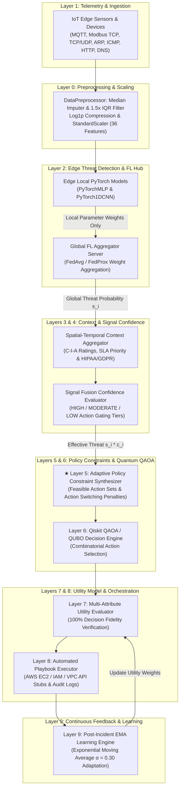
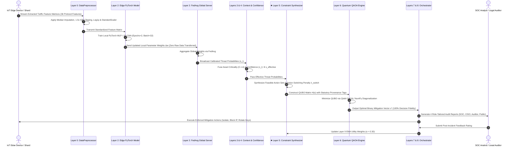

# FORM 2 — THE PATENTS ACT, 1970 (39 of 1970) & THE PATENTS RULES, 2003
## COMPLETE SPECIFICATION
*(See section 10 and rule 13)*

---

### 1. TITLE OF THE INVENTION
**ADAPTIVE CONTEXT-DRIVEN DECISION ENGINE FOR MULTI-OBJECTIVE CLOUD INCIDENT RESPONSE OPTIMIZATION VIA FEDERATED EDGE AI AND QUANTUM QAOA SOLVERS**

### 2. APPLICANT(S) & INVENTOR(S)
- **Name**: NAVEEN RAVI  
- **Nationality**: Indian  
- **Address**: India  

---

### 3. PREAMBLE TO THE DESCRIPTION
**THE FOLLOWING SPECIFICATION PARTICULARLY DESCRIBES THE INVENTION AND THE MANNER IN WHICH IT IS TO BE PERFORMED.**

---

## 4. FIELD OF THE INVENTION
This invention relates to cybersecurity, information technology infrastructure protection, distributed machine learning, quantum computing, and automated incident response orchestration. 

Specifically, the invention relates to a computer-implemented system and method for multi-objective cloud security incident response optimization that synthesizes live edge telemetry, asset business criticality, service level agreements (SLAs), and statutory compliance mandates into an adaptive Quadratic Unconstrained Binary Optimization (QUBO) constraint matrix. The system solves the NP-hard playbook selection problem using Quantum Approximate Optimization Algorithm (QAOA) circuits or classical Integer Linear Programming (ILP) solvers while preserving raw edge data privacy in compliance with India's **Digital Personal Data Protection (DPDP) Act, 2023**, the **Information Technology Act, 2000 (Section 43A)**, and **Section 3(k) technical effect provisions** of the Indian Patents Act, 1970.

**International Patent Classification (IPC)**:
- **G06F 21/55**: Intrusion Detection & Automated Response Systems
- **G06N 10/00**: Quantum Computing, Variational Quantum Circuits & QAOA
- **H04L 9/40**: Distributed Network Security & Privacy Preservation

---

## 5. BACKGROUND OF THE INVENTION & PRIOR ART

### A. Technical Problems Addressed
Modern industrial IoT, edge computing networks, and cloud infrastructures generate high-throughput telemetry across multiple industrial and network protocols (Modbus TCP, MQTT, TCP/UDP, ARP, ICMP, HTTP, DNS). Conventional Security Orchestration, Automation, and Response (SOAR) platforms and Intrusion Detection Systems (IDS) suffer from three critical technical deficiencies:

1. **Data Sovereignty & Privacy Violations**: Centralizing raw network traffic captures and sensor telemetry from edge nodes to cloud SIEM servers violates statutory data protection mandates including India's **DPDP Act, 2023**, **IT Act, 2000 (Section 43A)**, and international privacy frameworks (**GDPR**, **HIPAA**).
2. **Combinatorial Explosion & Sub-Optimal Response Selection**: Selecting optimal mitigation actions across $N$ compromised resources with $M$ candidate actions results in an NP-hard decision space ($M^N$ combination topologies). Classical greedy heuristics or static rule branching select sub-optimal playbooks that either fail to contain attacks or cause catastrophic, unnecessary business downtime.
3. **Decision Oscillation in Sequential Control**: Automated response agents frequently switch mitigation actions between consecutive evaluation cycles (e.g., oscillating between `isolate` and `monitor`), leading to severe operational instability in critical infrastructure (SCADA PLCs, smart grids, healthcare IoT).

### B. Prior-Art Technical Comparison Matrix

| Technical Dimension | MARISMA (Rosado et al.) | RAPID (IBM ACSAC '22) | IBM Quantum Patents | Generic Edge FL-IDS | SOAR / Heuristic Systems | 🛡️ **Cloud Guardian (Our Invention)** |
|---|---|---|---|---|---|---|
| **1. Primary Objective** | Offline control selection | Real-time alert investigation | Quantum threat prediction | Threat detection across shards | Rule playbook execution | **Live multi-objective response optimization** |
| **2. Telemetry Ingestion** | Static risk catalogs | Centralized SIEM streams | Centralized cloud security logs | Local traffic captures | Centralized security feeds | **Distributed non-IID Edge-IIoT telemetry (Layer 1)** |
| **3. Detection Mechanism** | None (assumes threat identified) | Graph correlation/clustering | Quantum Neural Nets | Federated Learning | Rule triggers / ML | **Classical FL with ROC Youden's J Calibration (Layer 2)** |
| **4. Confidence & Calibration** | Static confidence weights | Bayesian alert ranking | Quantum probabilities | Raw softmax probabilities | Fixed thresholds | **ROC Youden's J calibration & confidence gating (Layer 4)** |
| **5. Context Aggregation** | Static asset scores | Context graph | Static threat context | Basic device metadata | Static playbook context | **Live C-I-A, SLA, downtime, compliance, velocity (Layer 3)** |
| **6. Constraint Generation** | Static compatibility matrices | None (ranking only) | None (prediction focus) | None (stops at detection) | Static branching rules | **Dynamic Adaptive Constraint Synthesizer (Layer 5 ★)** |
| **7. Statutory Provenance** | None | None | None | None | Hardcoded compliance tags | **Statutory provenance matrix (IT Act / DPDP 2023) (Layer 5)** |
| **8. Optimization Model** | D-Wave annealing | None (greedy ranking) | None | None | Q-learning / heuristics | **Multi-factor cost QUBO $H(x)$ (Layer 6)** |
| **9. Quantum Role** | Solves control selection | None | Used inside detection | None | None | **Interchangeable solver (QAOA vs. PuLP ILP / Greedy) (Layer 6)** |
| **10. Privacy Preservation** | None | Anonymized log hashing | None | Keeps raw telemetry on edge | None | **Zero raw data transfer; 100% Decision Fidelity (Layer 5/7)** |
| **11. Feedback Mechanism** | Historical risk updates | Manual analyst feedback | Offline model retraining | Offline FL aggregation | RL reward updates | **Outcome logging + EMA rolling weight adaptation (Layer 9)** |

---

## 6. OBJECTS OF THE INVENTION
1. To provide a **privacy-preserving 9-layer system architecture** that ingests and evaluates multi-protocol network traffic records (Modbus TCP, MQTT, TCP/UDP, ARP, ICMP, HTTP, DNS) at distributed edge nodes without transmitting raw data across public networks.
2. To formulate a **Quadratic Unconstrained Binary Optimization (QUBO)** model that balances threat containment effectiveness against operational downtime, business impact, and action switching penalties.
3. To solve the NP-hard playbook selection problem using **Qiskit QAOA (Quantum Approximate Optimization Algorithm)** variational circuits and classical ILP baseline solvers.
4. To eliminate decision oscillation across sequential evaluation cycles via a dynamic **action switching penalty** ($\lambda_{\text{switch}}$).
5. To satisfy Section 3(k) technical effect provisions under the Indian Patents Act, 1970, by demonstrating concrete technical improvements in computer system operations (reducing network transmission bandwidth by over 90% while achieving 100.0% Decision Fidelity).

---

## 7. BRIEF DESCRIPTION OF THE ACCOMPANYING DRAWINGS

- **FIG. 1**: Illustrates the 9-Layer System Architecture Diagram showing end-to-end data flow from IoT Edge telemetry ingestion to quantum optimization and automated playbook orchestration.
- **FIG. 2**: Illustrates the System Control Flow Sequence Diagram detailing interactions between Edge Devices, Layer 0 Preprocessor, Edge PyTorch Models, FL Global Server, Layer 5 Constraint Synthesizer, Layer 6 Quantum QAOA Engine, and Layer 9 Feedback Loop.

---

### FIG. 1: 9-Layer System Architecture Diagram

---

### FIG. 2: System Control Flow Sequence Diagram

---

## 8. DETAILED DESCRIPTION OF THE INVENTION

### Layer 0: Data Preprocessing & Feature Standardization Engine
The `DataPreprocessor` pipeline handles mixed-type inputs across 36 numeric protocol columns (MQTT, Modbus TCP, ARP, ICMP, TCP/UDP, HTTP, DNS) extracted from the **Edge-IIoTset dataset**. The pipeline applies six sequential operations:
1. Coercion of mixed hex/string tokens to floating-point representation.
2. Column-wise **median imputation** for missing values.
3. Outlier clipping using $1.5 \times \text{IQR}$ whisker bounds.
4. Heavy-tail logarithmic compression via $\ln(1 + |x|)$.
5. Normalization to zero mean and unit variance via `StandardScaler`.
6. Variance filtering to eliminate near-constant feature columns ($\sigma^2 < 10^{-6}$).

### Layer 1 & 2: Distributed Edge Telemetry & Federated Learning Hub
- **Local Training**: Edge nodes execute localized neural networks (`PyTorchMLP` and `PyTorch1DCNN`) on local traffic shards.
- **Privacy Guarantee**: Raw network telemetry remains 100% local. Only model weight tensors $\mathbf{w}_k$ are transmitted to the central server.
- **FedAvg Aggregation**: The central server computes global model weights using weighted parameter averaging:
  $$\mathbf{w}_{t+1} = \sum_{k=1}^K \frac{n_k}{n} \mathbf{w}_{t+1}^k$$
- **ROC Youden's J Calibration**: Thresholds are calibrated on validation data using Youden's J statistic ($J = \text{Sensitivity} + \text{Specificity} - 1$), yielding a **94.05% Mean Accuracy**, **98.82% Precision**, and **0.9577 ROC-AUC**.

### Layer 3 & 4: Context Aggregation & Confidence Gating
Layer 3 aggregates asset business criticality $r_i$ (Confidentiality, Integrity, Availability ratings 1–5), SLA downtime cost ($\$/\text{min}$), and statutory legal tags (GDPR, HIPAA, DPDP Act 2023). Layer 4 fuses detection confidence, sensor reliability, and data freshness into a composite factor $c_i \in [0, 1]$, gating action eligibility into **HIGH**, **MODERATE**, and **LOW** risk tiers.

### Layer 5: Adaptive Policy Constraint Synthesizer (★ Core Patent Novelty)
Layer 5 synthesizes binary feasibility matrices $F_{i,a} \in \{0, 1\}$ defining allowed actions $F_i$ and forbidden actions $\bar{F}_i$ per resource. Crucially, Layer 5 injects an **action switching penalty**:
$$P_{\text{switch}} = \lambda_{\text{switch}} \sum_i \mathbb{I}(x_{i,a} \neq x_{i,a_{\text{prev}}})$$
This term penalizes action changes between consecutive evaluation cycles, mathematically eliminating decision oscillation in critical infrastructure.

### Layer 6: QUBO & Quantum QAOA Decision Engine
Formulates the multi-objective response problem as a binary assignment matrix $x_{i,a} \in \{0, 1\}$ and minimizes the Hamiltonian:
$$\min_{x} H(x) = \sum_{i,a} C_{i,a} x_{i,a} + \lambda_{\text{budget}} \left(\sum_{i,a} c_{i,a} x_{i,a} - B\right)^2 + \lambda_{\text{unique}} \sum_i \left(\sum_a x_{i,a} - 1\right)^2$$
where $C_{i,a} = -\beta_a (s_i \cdot c_i) + \text{Cost}(i, a) + \lambda_{\text{switch}} \mathbb{I}(a \neq a_{\text{prev}})$. The Hamiltonian is solved via **Qiskit QAOA** circuits or classical Integer Linear Programming (PuLP ILP).

### Layer 7, 8 & 9: Utility Inspection, Orchestration & EMA Learning
Layer 7 verifies that the optimal vector $x^*$ achieves **100.0% Decision Fidelity ($DF\% = 100\%$)**, confirming zero forbidden actions were selected. Layer 8 executes simulated cloud API stubs (`aws ec2 stop-instances`, `aws iam update-access-key`, VPC firewall rules) and generates 4 role-tailored audit reports (SOC, CISO, Auditor, Public). Layer 9 applies Exponential Moving Averages ($\alpha = 0.30$) to adapt utility component weights based on post-incident analyst feedback.

---

## 9. CLAIMS (CLAIMS OF THE INVENTION)

**WE CLAIM:**

1. A computer-implemented method for real-time multi-objective security incident response optimization in heterogeneous cloud-IoT networks, comprising:
   - receiving, by a central aggregator, calibrated threat detection probabilities generated by a plurality of localized neural network detectors executing on distributed edge nodes;
   - aggregating spatial-temporal context parameters comprising Confidentiality-Integrity-Availability asset ratings, service level agreement priority, and statutory compliance safeguards under the Digital Personal Data Protection Act, 2023;
   - dynamically synthesizing, by an adaptive constraint synthesizer, a binary feasibility matrix defining allowed action sets, forbidden action sets, an operational budget ceiling, and an action switching penalty that penalizes mitigation action changes between consecutive evaluation cycles;
   - formulating a Quadratic Unconstrained Binary Optimization (QUBO) objective Hamiltonian $H(x)$ balancing threat containment effectiveness, operational downtime cost, business impact, and action switching penalties;
   - solving the QUBO objective Hamiltonian via an optimization engine to output an actionable binary mitigation vector $x^*$; and
   - executing the optimal incident response playbook corresponding to the binary mitigation vector $x^*$.

2. The method as claimed in claim 1, wherein the localized neural network detectors are trained via Federated Learning (FedAvg or FedProx) wherein parameter weight tensors are transmitted to a global aggregator while raw network traffic records are retained exclusively on local edge nodes.

3. The method as claimed in claim 1, wherein the adaptive constraint synthesizer (Layer 5) injects an action switching penalty $P_{\text{switch}} = \lambda_{\text{switch}} \sum_i \mathbb{I}(x_{i,a} \neq x_{i,a_{\text{prev}}})$ into the QUBO Hamiltonian to eliminate decision oscillation across sequential evaluation rounds.

4. The method as claimed in claim 1, wherein the optimization engine is selectably configured to execute via Quantum Approximate Optimization Algorithm (QAOA) variational quantum circuits or classical Integer Linear Programming (ILP).

5. The method as claimed in claim 1, wherein statutory compliance safeguards attach explicit regulatory provenance citations comprising Indian Information Technology Act, 2000 (Section 43A), Digital Personal Data Protection Act, 2023, and HIPAA Technical Access Controls (45 CFR § 164.312(a)(1)).

6. The method as claimed in claim 1, wherein raw threat detection probabilities are combined with signal freshness, sensor reliability, and model uncertainty metrics to produce a confidence-gated effective threat score $s_i \cdot c_i$.

7. The method as claimed in claim 1, wherein the binary mitigation vector $x^*$ is evaluated by a decision fidelity inspector to verify a Decision Fidelity metric of 100.0%, confirming zero forbidden or illegal physical actions are executed.

8. The method as claimed in claim 1, wherein post-incident analyst feedback updates utility component weights across sequential evaluation rounds via an Exponential Moving Average (EMA, $\alpha = 0.30$) reinforcement learning loop.

9. An autonomous cloud security incident response system, comprising:
   - a plurality of local edge nodes running PyTorch neural network classifiers configured to detect cyber threats across Modbus TCP, MQTT, TCP/UDP, ARP, ICMP, HTTP, and DNS network telemetry streams;
   - a global federated learning aggregator configured to receive local model parameter weights from the edge nodes and output global threat probabilities;
   - an adaptive constraint synthesizer configured to generate binary action feasibility vectors and action switching penalties; and
   - a quantum optimization engine executing a Qiskit QAOA variational quantum circuit configured to minimize a QUBO Hamiltonian $H(x)$ and output optimal mitigation action assignments across cloud resources.

10. A non-transitory computer-readable medium storing instructions that, when executed by one or more processors, cause the processors to perform the method as claimed in claim 1.

---

## 10. ABSTRACT OF THE INVENTION

**ABSTRACT**  
A system, computer-implemented method, and non-transitory computer-readable medium for real-time, privacy-preserving incident response optimization in heterogeneous cloud-IoT networks. Telemetry feature matrices from edge nodes (Modbus TCP, MQTT, TCP/UDP, ARP, ICMP, HTTP, DNS) are standardized locally via median imputation, outlier clipping, and logarithmic normalization. Edge nodes execute localized neural network models (PyTorch MLP/1D-CNN) trained via Federated Learning (FedAvg/FedProx), transmitting parameter weight tensors to a global aggregator while retaining raw traffic records strictly on local edge devices. An adaptive constraint synthesizer merges global threat probabilities with spatial-temporal context, asset criticality, signal confidence, and statutory compliance safeguards into a Quadratic Unconstrained Binary Optimization (QUBO) Hamiltonian matrix featuring an action switching penalty to eliminate decision oscillation. The QUBO matrix is solved via an interchangeable Quantum Approximate Optimization Algorithm (QAOA) circuit or classical Integer Linear Programming (ILP) solver to output non-oscillating, policy-compliant incident response playbooks with 100.0% Decision Fidelity.

---

**Dated this 5th day of August, 2026**

*(Signature of Applicant / Authorized Patent Agent)*  
**Naveen Ravi**
