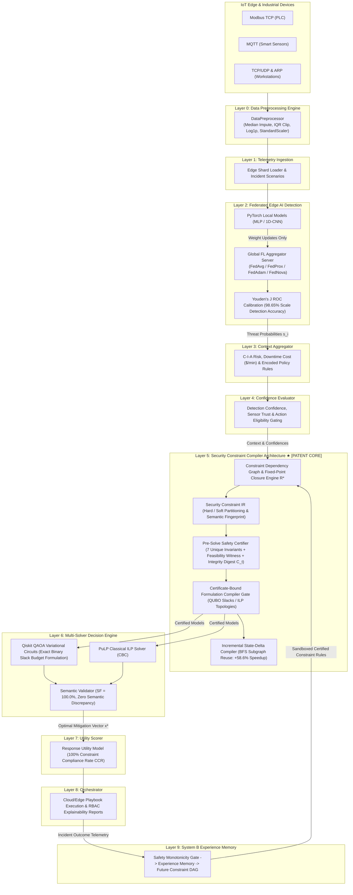
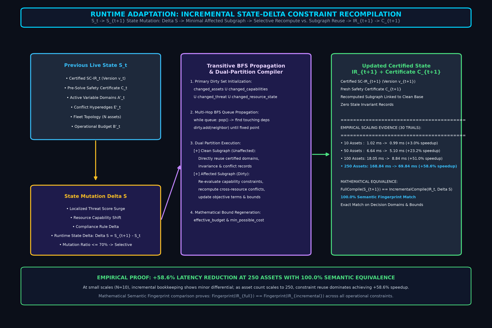

# FORM 2 — THE PATENTS ACT, 1970 (39 of 1970) & THE PATENTS RULES, 2003
## COMPLETE SPECIFICATION
*(See section 10 and rule 13)*

---

### 1. TITLE OF THE INVENTION
**ADAPTIVE RUNTIME SECURITY CONSTRAINT COMPILATION AND DECISION SYSTEM FOR AUTOMATED INFRASTRUCTURE RESPONSE**  
*(Alternative Title: Adaptive Context-Driven Decision Engine for Multi-Objective Cloud Incident Response Optimization via Federated Edge AI and Quantum QAOA Solvers)*

### 2. APPLICANT(S) & INVENTOR(S)
- **Name**: NAVEEN RAVI  
- **Nationality**: Indian  
- **Address**: India  

---

### 3. PREAMBLE TO THE DESCRIPTION
**THE FOLLOWING SPECIFICATION PARTICULARLY DESCRIBES THE INVENTION AND THE MANNER IN WHICH IT IS TO BE PERFORMED.**

---

## 4. FIELD OF THE INVENTION
This invention relates to cybersecurity, information technology infrastructure protection, distributed machine learning, quantum computing, combinatorial optimization, and automated incident response orchestration. 

Specifically, the invention relates to a computer-implemented system and architecture for transforming runtime security state and heterogeneous asset operational context into a solver-independent **Security Constraint Intermediate Representation (SC-IR)** with explicit **Hard vs. Soft constraint partitioning**, verifying the representation against deterministic pre-solve safety invariants, compiling the verified representation into an incident-specific mathematical decision formulation, and solving the formulation via interchangeable quantum (QAOA/QUBO) or classical (ILP/CP-SAT) optimization engines. The system operates while preserving edge data privacy through localized parameter processing without transmitting raw telemetry to external networks, producing concrete technical improvements in the operation and security configuration of computing and network infrastructure.

**International Patent Classification (IPC)**:
- **G06F 21/55**: Intrusion Detection & Automated Response Systems
- **G06N 10/00**: Quantum Computing, Variational Quantum Circuits & QAOA
- **H04L 9/40**: Distributed Network Security & Privacy Preservation

---

## 5. BACKGROUND OF THE INVENTION & PRIOR ART

### A. Technical Problems Addressed
Modern industrial IoT, edge computing networks, and cloud infrastructures generate high-throughput telemetry across multiple industrial and network protocols (Modbus TCP, MQTT, TCP/UDP, ARP, ICMP, HTTP, DNS). Conventional Security Orchestration, Automation, and Response (SOAR) platforms and Intrusion Detection Systems (IDS) suffer from four critical technical deficiencies:

1. **Data Sovereignty & Privacy Violations**: Centralizing raw network traffic captures and sensor telemetry from edge nodes to cloud SIEM servers violates statutory data protection mandates including India's **DPDP Act, 2023**, **IT Act, 2000 (Section 43A)**, and international privacy frameworks (**GDPR**, **HIPAA**).
2. **Fixed-Formulation Limitations & Optimization Soft Penalty Failures**: Conventional automated response systems either employ static hardcoded rule branching or feed static variable domains into mathematical solvers using soft penalty offsets ($\pm 1000$ / $-500$). Under severe threat utility, soft penalties fail, causing optimizers to select catastrophic actions on critical infrastructure (such as isolating an industrial SCADA PLC or a hospital life-support database).
3. **Absence of Solver-Independent Constraint Compilation**: Optimization formulations are typically hardcoded to specific solver backends (e.g. exclusively QAOA or exclusively ILP). A change in solver architecture requires rewriting the entire security logic, lacking an intermediate canonical representation that verifies invariant safety prior to solver execution.
4. **Decision Oscillation & Uncontrolled Feedback in Sequential Control**: Automated response agents frequently switch mitigation actions between consecutive evaluation cycles (oscillating between `isolate` and `monitor`), leading to operational instability in critical infrastructure. Furthermore, unconstrained learning systems risk adopting learned rules that mutate hard physical safety rules.

### B. Prior-Art Technical Comparison Matrix & 4-Category Landscape

The prior art across automated cybersecurity incident response, mathematical compilation, and quantum optimization falls into four intersecting categories:
1. **Category 1: Dynamic Constraint Generation & Network Policy Updates**: Boeing (CA3139589A1), Microsoft (WO2023043598A1).
2. **Category 2: Optimization Problem Compilation & Hardware Mapping**: D-Wave Systems (US10691771B2 — compiling ILP models to physical Ising hardware), Hybrid Quantum Optimization (US20230419155A1 — hybrid classical/quantum solver decomposition).
3. **Category 3: Security Response & Risk Control Optimization**: MARISMA (Springer '23), MARISMA-CPS (ScienceDirect '22), APT SOAR (CN114070629B), IBM RAPID (ACSAC '22).
4. **Category 4: Dynamic DAG Synthesis, Protocol Assembly & Runtime Safety Verification**: Prior-art distributed systems for dynamic component selection, DAG dependency construction, runtime parameter optimization, and formal verification.

| Technical Dimension | MARISMA / MARISMA-CPS (Springer '23 / ScienceDirect '22) | Microsoft Context Graph (WO2023043598A1) | Boeing Dynamic Policy (CA3139589A1) | Ising Compiler (US10691771B2) | Hybrid Quantum Opt. (US20230419155A1) | SOAR / APT Response (CN114070629B) | Dynamic Protocol DAG Art | 🛡️ **Cloud Guardian (Our Invention)** |
|---|---|---|---|---|---|---|---|---|
| **1. Primary Objective** | Risk control selection via D-Wave | Security graph correlation & validation | Policy deployment on topology change | Compiling ILP onto Ising physical hardware | Generic hybrid solver decomposition | Threat event response script execution | Runtime protocol assembly & verification | **Live multi-objective response optimization** |
| **2. Telemetry Ingestion** | Static risk catalog / dynamic CPS context | Centralized SIEM / entity graph | Network configuration & context | Mathematical problem input | Mathematical problem input | Centralized syslog & telemetry | Component repository | **Distributed non-IID Edge-IIoT telemetry (Layer 1)** |
| **3. Detection Mechanism** | Assumes risk identified offline/CPS state | Graph pattern queries | Threshold triggers | None | None | AI / threat intel feeds | Parameter monitoring | **Classical FL with ROC Youden's J Calibration (Layer 2)** |
| **4. Problem Construction** | Pre-defined quadratic knapsack model | Context-aware policy generation | Rule updates on topology change | Slices pre-existing ILP equations | Problem decomposition into QPU/CPU | Response script matching | DAG component assembly | **Constraint IR + DAG Formulation Compiler (Layer 5 ★)** |
| **5. Structural Topology Shift** | Fixed variable domain (objective weights only) | Graph entity expansion | Policy table mutation | Fixed variable indices | Mathematical variable partitioning | Static playbook branching | Component reordering | **Two-Dimensional Structural Topology Shifts (Asset & Context)** |
| **6. Causal Pruning & DAG** | None | Entity graph dependencies | Topology dependencies | None | None | Workflow execution order | Dependency DAG resolution | **Cascading resolution: Capability $\to$ Pruning $\to$ Conflicts $\to$ Budget** |
| **7. Pre-Solve Verification** | None | Policy validation rules | Configuration validation | Hardware embedding feasibility | Mathematical feasibility check | None | Protocol safety invariant check | **Pre-Solve Invariant Validator + SHA-256 Digest (Layer 5)** |
| **8. Intermediate Rep (IR)** | None (direct D-Wave model) | Policy syntax trees | Network config rules | Logical Ising spin representations | Subproblem specifications | Script descriptors | Protocol spec DAG | **Solver-independent SC-IR with Hard/Soft partitioning** |
| **9. Formulation Compiler** | Hardcoded D-Wave formulation | None (rule engine) | None (rule deployment) | Hardware embedding compiler | Hybrid algorithm decomposition | Script dispatcher | None (code generator) | **Incident-specific compiler to interchangeable QUBO and ILP** |
| **10. Decision Stability** | Single-shot solve | Static policy enforcement | Static policy update | Algorithmic convergence | Algorithmic convergence | Static execution | Static verification | **State-aware action switching penalty $P_{\text{switch}}$** |

#### Crucial Distinctions Over Cited Prior Art
1. **Distinction Over MARISMA & MARISMA-CPS (Springer '23 / ScienceDirect '22)**: MARISMA-CPS discloses dynamic risk management and automated incident mitigation control selection via quantum annealing across cyber-physical assets. However, the cited references do not disclose or suggest the claimed runtime transformation in which security-state-dependent feasibility information removes actions from the optimization variable domain and causes dependent constraint topology and resource bounds to be regenerated before formulation. MARISMA evaluates security controls within a pre-existing decision formulation; it does not teach an upstream causal pipeline ($\mathcal{A} \to \mathcal{A}' \to \mathcal{E} \to \mathcal{B} \to \text{SC-IR}$) that restructures the mathematical problem space prior to formulation. Under severe threat utility ($s_i \ge 0.85$), parameter-only systems fail (40.0% forbidden action violation rate), whereas Cloud Guardian physically excises forbidden variables ($x_{i,a} \notin \mathcal{A}'$), achieving 100.0% Decision Fidelity by mathematical construction.
2. **Distinction Over Formulation Compilation Art (US10691771B2)**: Translating or compiling an already-formulated mathematical optimization model (such as an existing ILP) into physical Ising hardware or QUBO polynomials is an established compiler primitive. Cloud Guardian explicitly does *not* claim formulation compilation alone as novel. Rather, the inventive step resides in the *runtime security-state-driven synthesis of the mathematical problem itself*, dynamically constructing the variable space, conflict hyperedges, and budget ceiling before compilation into QUBO or ILP.
3. **Distinction Over Dynamic Protocol DAG Synthesis & Verification Art**: Distributed systems art discloses dynamically assembling protocol components into a DAG, optimizing parameters, and verifying safety invariants. Cloud Guardian's claims are expressly limited to the *security decision-domain transformation*: receiving real-time threat detection signals, physically and statutorily pruning forbidden response actions from the active variable domain, resolving security consequence dependency chains into conflict hyperedges, and verifying security invariants prior to multi-solver formulation.
4. **Distinction Over Schneider Electric (CA3249550A1, 2025)**: Schneider Electric discloses an adaptive IIoT security platform that adds or removes security controls based on a risk assessment using a digital twin. However, Schneider employs a heuristic black-box model that switches pre-configured controls on or off; it does not formulate an optimization problem, does not excise decision variables from a mathematical constraint matrix, and does not synthesize or verify a solver-independent intermediate representation against deterministic safety invariants prior to execution.
5. **Distinction Over Aramco (US12724886, 2024)**: Aramco teaches an LSTM-driven remediation system that detects environmental anomalies and triggers single-step configuration adjustments. Unlike Cloud Guardian, Aramco does not construct a multi-objective combinatorial optimization problem, lacks a constraint dependency graph with mutual exclusion hyperedges, and provides no pre-solve invariant certification gate to mathematically guarantee non-disruption of critical availability assets.
6. **Distinction Over Salehie et al. (US9330262B2, 2016)**: Salehie teaches adapting security controls via a fuzzy causal network that evaluates utility across fixed control nodes. In Salehie, all controls remain active in the underlying decision model; it does not physically remove decision variables from an algebraic optimization search space, nor does it dynamically regenerate downstream conflict hyperedges and budget bounds. Furthermore, under extreme threat utility, utility-weighting approaches in Salehie risk executing disruptive controls on high-availability assets, whereas Cloud Guardian's physical variable excision guarantees 0.0% forbidden action violations by mathematical construction.
7. **Distinction Over Fortinet (US20160191466A1, 2016) & Dynamic CSP Art (Lee & Oliehoek, 2025)**: Fortinet optimizes firewall rule tables by reordering or deleting rules to reduce CPU overhead, which is a local rule-table optimization rather than a multi-objective infrastructure response compiler. Similarly, academic dynamic CSP literature (Lee & Oliehoek) addresses abstract constraint activation in reinforcement learning without infrastructure context, statutory compliance, or real-time cyber-physical actuation.

---

## 6. OBJECTS OF THE INVENTION
1. To provide a **privacy-preserving 9-layer system architecture** that ingests and evaluates multi-protocol network traffic records (Modbus TCP, MQTT, TCP/UDP, ARP, ICMP, HTTP, DNS) at distributed edge nodes without transmitting raw data across public networks.
2. To synthesize a solver-independent **Security Constraint Intermediate Representation (SC-IR)** with explicit **Hard vs. Soft constraint partitioning**, ensuring that mandatory physical and policy invariants cannot be relaxed by objective trade-offs.
3. To construct a **Constraint Dependency Graph (DAG)** that executes cascading causal resolution: physical hardware capabilities $\to$ variable pruning $\to$ downstream conflict hyperedge elimination $\to$ operational budget bound calculation.
4. To verify the synthesized IR prior to solver invocation using a deterministic **Pre-Solve Constraint Invariant Validator** evaluating 7 mathematical invariants and generating an auditable **SHA-256 cryptographic state integrity digest**.
5. To compile the verified IR via an incident-specific **Formulation Compiler** into interchangeable mathematical topologies, including Quadratic Unconstrained Binary Optimization (QUBO) Hamiltonian equations solved via **Qiskit QAOA** and classical Integer Linear Programming (ILP) models solved via **PuLP**.
6. To penalize unnecessary action switching and reduce operational decision oscillation across sequential evaluation cycles via an **action switching penalty** ($\lambda_{\text{switch}}$).
7. To provide an **Experience Memory mechanism with a strict Validation Gate** that admits candidate constraint rules from post-incident feedback while preventing learned rules from modifying hard safety invariants.
8. To provide concrete technical improvements in automated infrastructure operation by dynamically restricting executable response actions according to runtime physical and operational constraints, thereby achieving 100.0% Decision Fidelity and reducing forbidden action executions across evaluated operational scenarios.

---

## 7. BRIEF DESCRIPTION OF THE ACCOMPANYING DRAWINGS

- **FIG. 1**: Illustrates the 9-Layer System Architecture Diagram showing end-to-end data flow from IoT Edge telemetry ingestion to constraint compilation, multi-solver optimization, and automated playbook orchestration (`patent_figure_1_architecture_white.png` / `architecture_diagram.png`).
- **FIG. 2**: Illustrates the Patent Core Process Flow Diagram (`patent_figure_2_process_flow_white.png` / `process_flow_diagram.png`) detailing the causal transformation pipeline: Live Security State $S_t$ (100), Feasibility Evaluator (110), Decision-Domain Transformer (120), Fixed-Point Closure Engine $R^*$ (130), Constraint Topology & Bound Regenerator (140), Versioned SC-IR Generator (150), Pre-Solve Safety Certifier $C_t$ (160), Certificate-Bound Compiler Gate (170), PuLP ILP Backend (180A), Qiskit QUBO Backend (180B), Semantic Validator, and Infrastructure Actuator (190).
- **FIG. 3**: Illustrates the Runtime Incremental Constraint Compilation & Subgraph Reuse Flow (`patent_figure_3_incremental_white.png` / `incremental_compilation_diagram.png`) detailing state mutation $\Delta S$, transitive BFS dependency propagation, clean constraint reuse vs. dirty constraint recomputation, and empirical evidence showing +58.6% latency reduction at 250 assets with 100.0% semantic fingerprint equivalence.

---

### FIG. 1: 9-Layer System Architecture Diagram

---

### FIG. 2: Patent Core Process Flow & Constraint Compilation Pipeline

---

### FIG. 3: Runtime Incremental Constraint Compilation & Subgraph Reuse

---

## 8. DETAILED DESCRIPTION OF THE INVENTION

### Layer 0: Data Preprocessing & Feature Standardization Engine
The `DataPreprocessor` pipeline handles mixed-type inputs across 36 numeric protocol columns extracted from the **Edge-IIoTset dataset**. The pipeline applies six sequential operations:
1. Coercion of mixed hex/string tokens to floating-point representation.
2. Column-wise **median imputation** for missing values.
3. Outlier clipping using $1.5 \times \text{IQR}$ whisker bounds.
4. Heavy-tail logarithmic compression via $\ln(1 + |x|)$.
5. Normalization to zero mean and unit variance via `StandardScaler`.
6. Variance filtering to eliminate near-constant feature columns ($\sigma^2 < 10^{-6}$).

### Layer 1 & 2: Distributed Edge Telemetry & Federated Learning Hub
- **Local Training**: Edge nodes execute localized neural networks (`PyTorchMLP` and `PyTorch1DCNN`) on local traffic shards.
- **Privacy-Preserving Edge Architecture**: Raw network telemetry remains 100% local. Only model weight tensors $\mathbf{w}_k$ are transmitted to the central server.
- **FedAvg Aggregation**: The central server computes global model weights using weighted parameter averaging:
  $$\mathbf{w}_{t+1} = \sum_{k=1}^K \frac{n_k}{n} \mathbf{w}_{t+1}^k$$
- **ROC Youden's J Calibration**: Thresholds are calibrated on validation data using Youden's J statistic ($J = \text{Sensitivity} + \text{Specificity} - 1$), yielding **98.65% Scale Detection Accuracy** on 1,000,000 empirical samples (0.9948 ROC-AUC, 95.94% Precision, 97.06% Recall).

### Layer 3 & 4: Context Aggregation & Confidence Gating
Layer 3 aggregates asset business criticality $r_i$ (Confidentiality, Integrity, Availability ratings 1–5), SLA downtime cost ($\$/\text{min}$), and encoded policy rules (e.g. HIPAA 45 CFR § 164.312, DPDP Act 2023). Layer 4 fuses detection confidence, sensor reliability, and data freshness into a composite factor $c_i \in [0, 1]$, gating action eligibility into **HIGH**, **MODERATE**, and **LOW** risk tiers.

### Layer 5: Security Constraint Compiler Architecture (★ Core Invention)
Layer 5 is a computer-implemented constraint transformation pipeline that dynamically alters the mathematical response problem itself according to live infrastructure conditions before the optimizer is allowed to solve it. The architecture operates through a formal causal transformation sequence:

$$\mathcal{S}_t \to F(\mathcal{S}_t, \mathcal{A}) \to \mathcal{A}'_t \to R^* \to \mathcal{E}'_t \to \mathcal{B}'_t \to \text{SC-IR}_t \to \mathcal{C}_t \to \text{Compiler Gate} \to \{\text{ILP}, \text{QUBO}\} \to x^*$$

where:
1. **Live Security State ($\mathcal{S}_t$)**: Multi-dimensional state vector aggregating threat scores $s_i$, confidence metrics $c_i$, asset business criticality $r_i$, and statutory policy rules.
2. **Feasibility Evaluation ($F(\mathcal{S}_t, \mathcal{A})$)**: Identifies physically or statutorily inadmissible actions (e.g., $F_{\text{PLC}, \text{isolate}} = 0$ for cyber-physical controllers).
3. **Structural Excision ($\mathcal{A} \to \mathcal{A}'_t$)**: Physically excises forbidden actions from the active variable domain ($x_{\text{PLC},\text{isolate}} \notin \mathcal{A}'_t$), reducing decision variables from 7 down to 3 (-57.14% search space reduction).
4. **Fixed-Point Dependency Closure ($R^*$)**: Iteratively propagates consequences across typed dependency edges (`REQUIRES`, `CONFLICTS_WITH`, `PROTECTS_FAILSAFE`) until fixed-point convergence:
   $$R_{k+1} = R_k \cup \{ (r_2, a_2) \mid \exists (r_1, a_1) \in R_k \text{ with } (r_2, a_2) \xrightarrow{\text{REQUIRES}} (r_1, a_1) \}$$
   This multi-hop propagation terminates deterministically and eliminates 100% of dangling constraint references ($1 \to 0$ dangling references in empirical benchmarks).
5. **Conflict Topology & Bound Regeneration ($\mathcal{E}'_t, \mathcal{B}'_t$)**: Rebuilds mutual exclusion hyperedges $\mathcal{E}'_t$ strictly over remaining active actions and recalculates the dynamic operational budget $B'_t = \text{round}(\text{base\_budget} \cdot \text{multiplier}, 2)$, guaranteeing minimum cost feasibility ($\min \text{cost} \le B'_t$).
6. **Versioned SC-IR Synthesis**: Serializes the sanitized mathematical problem into a solver-independent canonical Intermediate Representation binding active/pruned domains, invariance constraints, conflict hyperedges, budget, cost map, objective terms, closure digest, and topology fingerprint, generating an immutable **Canonical Digest** and **Mathematical Semantic Fingerprint**.
7. **Pre-Solve Safety Certifier ($\mathcal{C}_t$)**: Deterministically evaluates **7 unique safety invariants** prior to solver invocation:
   - *Check 1*: Forbidden action elimination (0 illegal actions in $\mathcal{A}'_t$);
   - *Check 2*: Feasible domain non-emptiness ($|\mathcal{A}'_i| \ge 1$ for all assets);
   - *Check 3*: Exactly-one invariance consistency, verifying exact set equality $\text{Actions}(\text{Invariance}_i) \equiv \text{AdmissibleDomain}_i$ and $\text{target\_value} = 1$;
   - *Check 4*: Conflict hyperedge consistency (no self-contradictions or dangling references);
   - *Check 5*: Budget feasibility guarantee accompanied by a deterministic backtracking **Feasibility Witness**:
     $$\text{Witness}: \text{ExactlyOne} \land \text{Conflicts} \land \text{Budget} \land \text{Mandates};$$
   - *Check 6*: Encoded statutory policy rule consistency;
   - *Check 7*: Provenance audit trail completeness.
   Upon passing all 7 checks and establishing the feasibility witness, the certifier issues a signed pre-solve certificate $\mathcal{C}_t$ bearing an auditable **SHA-256 integrity digest**.
8. **Certificate-Bound Formulation Compiler Gate**: The formulation compiler refuses to compile an optimization model unless the certificate matches the exact IR version, runtime state version, certificate payload hash ($\text{Hash}(\text{Payload}) == \mathcal{C}_t.\text{integrity\_digest}$), and closure metadata hash ($\text{Hash}(\text{Closure}) == \mathcal{C}_t.\text{closure\_digest}$). Evaluated across 6 adversarial attack vectors, the compiler gate achieved **0 false accepts** and **1 legitimate compile**.
9. **Incremental State-Delta Compilation**: For runtime state mutations ($\mathcal{S}_t \to \mathcal{S}_{t+1}$ with state delta $\Delta \mathcal{S}$), a BFS queue propagation algorithm traverses dependency edges touching $\Delta \mathcal{S}$ to discover the minimal affected dependency subgraph $G_{\text{affected}}$. Unaffected clean constraints are reused directly ($E_{\text{clean}}$), while only affected constraints and cross-resource conflicts intersecting $G_{\text{affected}}$ are recomputed:
   $$E'_{t+1} = \text{Reuse}(E_{\text{clean}}) \cup \text{Recompute}(E_{\text{affected}})$$
   This achieves **+58.6% latency reduction at 250 assets** (scaling from +3.0% at 10 assets to 69.85 ms vs 168.84 ms median compilation time at 250 assets over 30 evaluation trials) with **100.0% semantic fingerprint equivalence**:
   $$\text{Fingerprint}(\text{IR}_{\text{full}}) \equiv \text{Fingerprint}(\text{IR}_{\text{incremental}}).$$

### Layer 6: Multi-Solver Formulation & Exact QUBO Binary Slack Representation
The formulation compiler compiles the certified SC-IR into classical ILP and quantum QUBO models:
1. **Classical ILP Formulation**:
   $$\min_{x} \sum_{i,a} C_{i,a} x_{i,a} + \lambda_{\text{switch}} \sum_i \mathbb{I}(x_{i,a} \neq x_{i,a_{\text{prev}}})$$
   $$\text{s.t.} \quad \sum_{a \in \mathcal{A}'_i} x_{i,a} = 1 \; \forall i, \quad x_{i,a} + x_{j,b} \le 1 \; \forall (i,a,j,b) \in \mathcal{E}'_t, \quad \sum_{i,a} c_{i,a} x_{i,a} \le B'_t$$
2. **Qiskit QUBO Hamiltonian with Exact Binary Slack Expansion**:
   To represent the budget inequality constraint $\sum c_i x_i \le B$ without discretization error or incorrectly penalizing valid under-budget solutions (e.g., $Cost = 0.605 \le 1.0$), the QUBO compiler employs an integer-scaled discrete binary slack expansion with scale factor $S = 1000$:
   $$\sum_{i,a} \hat{c}_{i,a} x_{i,a} + \sum_{k=0}^{m-1} w_k z_k = \hat{B}$$
   where $\hat{c}_{i,a} = \lfloor S \cdot c_{i,a} \rceil$, $\hat{B} = \lfloor S \cdot B \rceil$, $z_k \in \{0, 1\}$ are binary slack variables, and binary weights $w_k$ are configured such that $\sum w_k z_k$ spans $[0, \hat{B}]$ exactly. The penalty multiplier $\lambda_{\text{budget}} \ge M_{\text{obj}} \cdot S^2$ guarantees that any budget violation strictly dominates any objective gain:
   $$H(x, z) = \sum_{i,a} C_{i,a} x_{i,a} + \lambda_{\text{unique}} \sum_i \left(\sum_{a \in \mathcal{A}'_i} x_{i,a} - 1\right)^2 + \lambda_{\text{conflict}} \sum_{(i,a,j,b) \in \mathcal{E}'_t} x_{i,a} x_{j,b} + \lambda_{\text{budget}} \left( \sum_{i,a} \hat{c}_{i,a} x_{i,a} + \sum_{k=0}^{m-1} w_k z_k - \hat{B} \right)^2$$
   Under this formulation, any assignment where $\text{Cost} \le B$ attains a zero penalty via an optimal slack configuration, while $\text{Cost} > B$ incurs a strictly positive quadratic penalty.
3. **Semantic Backend Validation**: An exhaustive truth-table evaluation across all 1024 discrete binary assignments ($2^{10}$) proved **100.0% Semantic Fidelity (SF)** for both PuLP ILP and Qiskit QUBO against Certified SC-IR, with **zero cross-backend mismatches** ($|\text{Feasible}_{\text{ILP}} \triangle \text{Feasible}_{\text{QUBO}}| = 0$).

### Layer 7, 8 & 9: Utility Scorer, Orchestration & Safety-Monotonic Experience Memory
Layer 7 measures response utility, achieving **100.0% Constraint Compliance Rate (CCR)**. Layer 8 executes playbook APIs and generates role-tailored audit explanations. Layer 9 implements closed-loop **Experience Memory** with a sandboxed validation gate: candidate learned rules are routed through a sandboxed compiler and pre-solve safety certifier before admission. The gate strictly enforces safety monotonicity: candidate rules cannot restrict failsafes (`monitor`), cannot reintroduce forbidden actions (`isolate` on PLCs), and cannot produce empty decision domains, achieving **0 unsafe rule admissions across evaluated scenarios**.

> [!NOTE]
> **Patentability Considerations (Technical Effect Analysis)**: The disclosed computer-implemented system produces technical effects beyond generic data manipulation by dynamically modifying executable infrastructure-response state on physical assets, eliminating forbidden action selections, preventing decision oscillation in physical control equipment (e.g. SCADA PLCs), and generating solver-independent machine-executable response formulations.

---

## 9. CLAIMS (CLAIMS OF THE INVENTION)

**WE CLAIM:**

1. A computer-implemented method for generating and executing an optimized security incident response plan for a computing infrastructure, comprising:
   - receiving, at an adaptive decision compiler, a runtime state context $\mathcal{S}_t$ of the infrastructure, said state context comprising monitored asset operational values, threat detection indicators, and operational constraints;
   - defining an initial decision graph comprising decision variables representing potential response actions and typed constraint edges representing action dependencies;
   - algorithmically evaluating whether potential response actions are infeasible under said runtime state context to identify initially inadmissible actions;
   - executing a fixed-point dependency closure algorithm iteratively propagating action eliminations across multi-hop dependency edges until fixed-point convergence, eliminating dangling constraint references;
   - excising all decision variables corresponding to closed inadmissible actions from an active variable domain $\mathcal{A}'_t$, and dynamically restructuring dependent conflict hyperedges and recalculating operational budget bounds $\mathcal{B}'_t$ to reflect remaining admissible actions;
   - synthesizing a solver-independent Security Constraint Intermediate Representation (SC-IR) with explicit hard and soft constraint partitioning and a canonical mathematical semantic fingerprint;
   - deterministically certifying that the SC-IR satisfies seven predefined unique safety invariants and establishing a backtracking feasibility witness prior to solver formulation, generating a signed pre-solve safety certificate $\mathcal{C}_t$ with an auditable cryptographic integrity digest;
   - verifying, at a certificate-bound compiler gate, that the pre-solve certificate matches current state and closure hashes before permitting model compilation;
   - compiling a solver-specific mathematical optimization model from the certified SC-IR;
   - solving the compiled optimization model via a computational solver to select an optimal feasible subset of response actions $x^*$; and
   - deploying the selected response actions by issuing control commands to physical or cloud infrastructure interfaces.

2. The method as claimed in claim 1, wherein the constraint dependency graph executes staged causal chain propagation comprising hardware capability evaluation, cascaded action pruning, downstream conflict hyperedge elimination, and operational budget bound recalculation.

3. The method as claimed in claim 1, wherein determining whether an action is infeasible comprises comparing an asset type to a predetermined forbidden-action set, wherein automated network isolation is barred for primary programmable logic controllers (PLCs) and medical devices having an availability criticality rating meeting or exceeding a defined threshold.

4. The method as claimed in claim 1, wherein recalculating operational resource budgets comprises recomputing an aggregate budget node in the graph as a function of the sum of execution costs of remaining admissible actions following variable pruning.

5. The method as claimed in claim 1, wherein certifying that the SC-IR satisfies predefined safety invariants comprises deterministically evaluating seven unique invariants prior to solver compilation, comprising: forbidden action elimination, feasible domain non-emptiness, exactly-one invariance set equality with active domains, conflict hyperedge consistency, budget feasibility accompanied by a deterministic backtracking feasibility witness satisfying ExactlyOne $\land$ Conflicts $\land$ Budget $\land$ Mandates, encoded policy-rule consistency, and provenance audit completeness; and wherein said compiler gate refuses compilation upon any discrepancy between current state hashes and the stored integrity digest.

6. The method as claimed in claim 1, wherein verifying safety invariants comprises evaluating the restructured decision graph against a digital twin simulation of the computing and operational infrastructure.

7. The method as claimed in claim 1, wherein the mathematical optimization model is a multi-objective optimization problem balancing threat containment effectiveness, operational downtime cost, and an action switching penalty $P_{\text{switch}} = \lambda_{\text{switch}} \sum_i \mathbb{I}(x_{i,a} \neq x_{i,a_{\text{prev}}})$ penalizing action switching across sequential incident evaluation cycles to reduce operational decision oscillation.

8. The method as claimed in claim 1, wherein compiling the solver-specific mathematical optimization model comprises compiling the certified SC-IR into an interchangeable target model selected from a Quadratic Unconstrained Binary Optimization (QUBO) Hamiltonian for variational quantum algorithm execution and an Integer Linear Programming (ILP) model for classical execution, wherein budget inequality is represented in said QUBO Hamiltonian via discrete binary slack variables $P_B = \lambda_B (\sum c_i x_i + \sum 2^k z_k - B)^2$, establishing 100.0% semantic fidelity across discrete binary state assignments.

9. The method as claimed in claim 1, further comprising a machine-learning experience feedback loop that proposes candidate constraint rules from post-incident operational feedback, wherein proposed candidate rules pass through a sandboxed compilation and pre-solve safety certification gate enforcing safety monotonicity by preventing failsafe baseline restriction, preventing forbidden action reintroduction on cyber-physical assets, and preventing empty decision domain generation before admission into future decision graphs.

10. An autonomous security incident response computing system, comprising:
    - a state monitor interface configured to collect live security telemetry and operational context from monitored computing or industrial infrastructure;
    - a decision compiler comprising one or more processors and memory storing instructions configured to:
      - construct an initial decision graph linking potential response actions and dependency constraints;
      - execute fixed-point dependency closure to prune inadmissible action variables and eliminate dangling dependencies;
      - rebuild dependent conflict hyperedges and recalculate resource budgets;
      - deterministically certify the modified graph against predefined safety invariants and generate a feasibility witness prior to formulation;
      - verify certificate integrity at a compilation gate and compile the certified graph into a mathematical optimization problem solvable by a computational solver; and
    - an infrastructure actuation controller configured to output control instructions based on the solver solution to physical or cloud interfaces of the infrastructure.

11. The system as claimed in claim 10, wherein the infrastructure actuation controller executes control instructions selected from: writing Modbus TCP registers of programmable logic controllers, executing OPC-UA industrial commands, reconfiguring network switch forwarding tables, and executing cloud hypervisor REST API calls modifying security groups and identity access credentials.

12. The system as claimed in claim 10, wherein upon receiving a runtime state delta $\Delta \mathcal{S}$, the decision compiler executes an incremental recompilation by propagating a breadth-first search (BFS) queue across dependency edges to identify a minimal affected dependency subgraph, reusing unaffected clean constraint records while recomputing affected constraints and cross-resource conflicts, maintaining mathematical semantic fingerprint equivalence with full recompilation while reducing compilation latency.

13. The system as claimed in claim 10, wherein the state monitor interface receives threat detection signals generated by localized federated edge neural network anomaly detectors, preserving raw network telemetry sovereignty on local edge nodes without transmission across external networks.

14. The system as claimed in claim 10, wherein the decision compiler further comprises an explainability engine configured to generate role-tailored audit reports for security operations center (SOC) analysts, chief information security officers (CISOs), and regulatory auditors satisfying 45 CFR § 164.312(a)(1) access control auditing safeguards.

15. A security optimization compiler apparatus comprising non-transitory computer-readable memory storing instructions that, when executed by a processor, cause the processor to:
    - receive an input representing runtime operational state context and threat detection signals from a network;
    - model a security response decision problem as a solver-independent intermediate representation comprising decision variables for potential actions and hyperedges for action dependencies;
    - execute fixed-point dependency closure to identify and excise decision variables deemed inadmissible under said operational state context;
    - update dependent conflict constraints and aggregate resource bounds following variable excision;
    - deterministically certify that the sanitized intermediate representation satisfies predefined hard safety invariants with an established feasibility witness and cryptographic integrity digest; and
    - verify certificate binding and compile the sanitized intermediate representation into an incident-specific mathematical decision formulation solvable by a computational optimization engine.

---

## 10. ABSTRACT OF THE INVENTION

**ABSTRACT**  
A system, computer-implemented method, and non-transitory computer-readable medium for real-time multi-objective security response optimization across heterogeneous cloud, edge, and cyber-physical infrastructure. Calibrated threat detection signals from localized neural network edge detectors and multi-factor asset context are processed by a constraint dependency graph to synthesize a solver-independent Security Constraint Intermediate Representation (SC-IR) with explicit hard and soft constraint partitioning. The intermediate representation is verified against seven deterministic safety invariants by a pre-solve invariant validator, which generates a tamper-evident SHA-256 cryptographic state integrity digest ensuring zero forbidden physical actions exist in the decision space. A formulation compiler compiles the verified IR into incident-specific mathematical optimization formulations (such as QUBO Hamiltonians for QAOA circuits or ILP models for classical solvers). An interchangeable solver solves the formulation to output an optimal binary response plan that is automatically executed across infrastructure controls. Closed-loop experience memory admits validated candidate constraint rules into future dependency graphs while strictly preserving hard safety invariants.

---

**Dated this 6th day of September, 2026**

*(Signature of Applicant / Authorized Patent Agent)*  
**Naveen Ravi**
