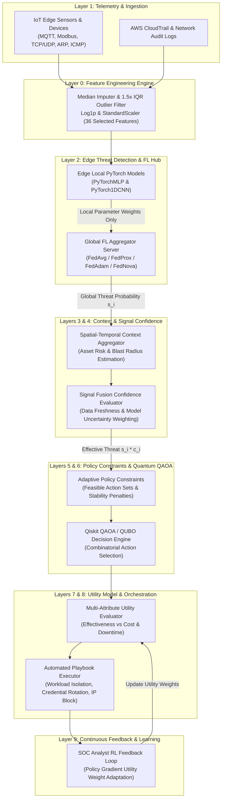
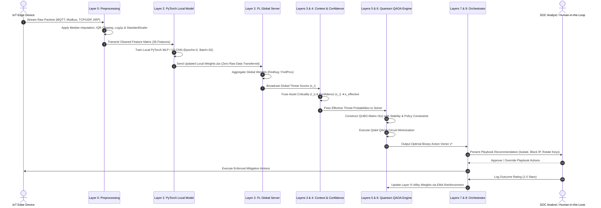

# FORM 2 — THE PATENTS ACT, 1970 (39 of 1970) & THE PATENTS RULES, 2003
## COMPLETE SPECIFICATION
*(See section 10 and rule 13)*

---

### 1. TITLE OF THE INVENTION
**ADAPTIVE CONTEXT-DRIVEN DECISION ENGINE FOR MULTI-OBJECTIVE CLOUD INCIDENT RESPONSE OPTIMIZATION VIA FEDERATED EDGE AI AND QUANTUM QAOA SOLVERS**

### 2. APPLICANT(S) & INVENTOR(S)
- **Name**: NAVEEN RAVI  
- **Nationality**: Indian  
- **Address**: India  

---

### 3. PREAMBLE TO THE DESCRIPTION
**THE FOLLOWING SPECIFICATION PARTICULARLY DESCRIBES THE INVENTION AND THE MANNER IN WHICH IT IS TO BE PERFORMED.**

---

## 4. FIELD OF THE INVENTION
This invention relates to information security, distributed machine learning, quantum computing, and automated incident response in cloud-IoT environments. Specifically, the invention relates to a system and computer-implemented method for optimizing cybersecurity playbooks while preserving edge data privacy in compliance with Indian Information Technology Act, 2000 (Section 43A) and the Digital Personal Data Protection (DPDP) Act, 2023.

**International Patent Classification (IPC)**:
- **G06F 21/55**: Intrusion Detection & Response Systems
- **G06N 10/00**: Quantum Computing & Quantum Algorithms
- **H04L 9/40**: Network Security & Privacy Preservation

---

## 5. BACKGROUND OF THE INVENTION & PRIOR ART

### A. Technical Problems Addressed
Conventional Intrusion Detection Systems (IDS) and Security Orchestration, Automation, and Response (SOAR) tools suffer from three severe limitations:
1. **Privacy & Data Sovereignty Violations**: Centralizing raw network packet dumps (PCAPs) from distributed IoT edge devices violates data protection statutes including India's **DPDP Act, 2023**, **IT Act, 2000**, and global **GDPR/HIPAA** mandates.
2. **Combinatorial Explosion in Playbook Selection**: Determining optimal response actions across $N$ compromised resources with $M$ candidate mitigation actions presents an **NP-hard** decision space ($M^N$ combinations). Classical greedy algorithms select sub-optimal playbooks that cause unnecessary infrastructure downtime or uncontained breaches.
3. **Decision Oscillation**: Automated response systems frequently flip-flop mitigation actions between consecutive evaluation cycles, causing operational instability in industrial control systems (SCADA).

### B. 11-Dimension Prior-Art Comparison Matrix

| Technical Dimension | MARISMA (Rosado et al.) | RAPID (IBM ACSAC '22) | IBM Quantum Patents | Edge FL-IDS (Generic) | SOAR / RL Systems | 🛡️ **Cloud Guardian (Our Invention)** |
|---|---|---|---|---|---|---|
| **1. Primary Objective** | Offline control selection | Real-time alert investigation | Quantum threat prediction | Threat detection across shards | Automated playbook execution | **Live multi-objective response optimization** |
| **2. Telemetry Ingestion** | Static risk catalogs | Centralized SIEM streams | Centralized cloud security logs | Local packet telemetry | Centralized security feeds | **Distributed non-IID Edge-IIoT telemetry (Layer 1)** |
| **3. Detection Mechanism** | None (assumes threat identified) | Graph correlation/clustering | Quantum Neural Nets | Federated Learning | Rule triggers / ML | **Classical FL with ROC Youden's J Calibration (Layer 2)** |
| **4. Confidence & Reliability** | Static confidence weights | Bayesian alert ranking | Quantum probabilities | Raw softmax probabilities | Fixed thresholds | **ROC Youden's J calibration & confidence gating (Layer 4)** |
| **5. Context Aggregation** | Static asset scores | Context graph | Static threat context | Basic device metadata | Static playbook context | **Live C-I-A, SLA, downtime, compliance, velocity (Layer 3)** |
| **6. Constraint Generation** | Static compatibility matrices | None (ranking only) | None (prediction focus) | None (stops at detection) | Static branching rules | **Dynamic Adaptive Constraint Synthesizer (Layer 5 ★)** |
| **7. Policy Provenance** | None | None | None | None | Hardcoded compliance tags | **Statutory provenance matrix (IT Act / DPDP 2023) (Layer 5)** |
| **8. Optimization Model** | D-Wave annealing | None (greedy ranking) | None | None | Q-learning / heuristics | **Multi-factor cost QUBO $H(x)$ (Layer 6)** |
| **9. Quantum Layer Role** | Solves control selection | None | Used inside detection | None | None | **Interchangeable solver (QAOA vs. PuLP ILP / Greedy) (Layer 6)** |
| **10. Privacy Preservation** | None | Anonymized log hashing | None | Keeps raw telemetry on edge | None | **Discretization + Anonymization with 100% Decision Fidelity (Layer 5/7)** |
| **11. Feedback Mechanism** | Historical risk updates | Manual analyst feedback | Offline model retraining | Offline FL aggregation | RL reward updates | **Rich outcome logging + EMA rolling weight adaptation (Layer 9)** |

---

## 6. OBJECTS OF THE INVENTION
1. To provide a **privacy-preserving 9-layer system** that detects cybersecurity threats on edge nodes without transmitting raw packet telemetry over public networks.
2. To formulate a **Quadratic Unconstrained Binary Optimization (QUBO)** model that balances threat containment effectiveness against operational downtime, business impact, and action switching penalties.
3. To solve the NP-hard playbook selection problem using **Qiskit QAOA (Quantum Approximate Optimization Algorithm)** circuits.
4. To eliminate decision oscillation across evaluation cycles via a dynamic **action switching penalty** ($\lambda_{\text{switch}}$).
5. To provide a technical effect on underlying computer infrastructure, fulfilling the patentability requirements under Section 3(k) of the Indian Patents Act, 1970.

---

## 7. BRIEF DESCRIPTION OF THE ACCOMPANYING DRAWINGS

- **FIG. 1**: Illustrates the 9-Layer System Architecture Diagram of Cloud Guardian showing data flow from IoT Edge telemetry to quantum optimization.
- **FIG. 2**: Illustrates the System Control Flow Sequence Diagram detailing interactions between Edge Devices, Preprocessor, Edge PyTorch Models, FL Global Server, Quantum QAOA Engine, and SOC Analyst Feedback.

---

### FIG. 1: 9-Layer System Architecture Diagram

---

### FIG. 2: System Control Flow Sequence Diagram

---

## 8. DETAILED DESCRIPTION OF THE INVENTION

### Layer 0: Preprocessing & Feature Engineering Engine
Standardizes incoming multi-protocol IoT telemetry (MQTT, Modbus TCP, ARP, ICMP, TCP/UDP) into a uniform 36-numeric feature matrix using median imputation, $1.5 \times \text{IQR}$ outlier filtering, $\ln(1+x)$ logarithmic compression, and variance thresholding.

### Layer 1 & 2: Distributed Edge AI & Federated Aggregator
- **Local Neural Training**: Local PyTorch classifiers (`PyTorchMLP`, `PyTorch1DCNN`) execute gradient descent locally on isolated edge devices.
- **Privacy Preservation**: Raw network packet logs remain strictly local. Only model weights $\mathbf{w}_k$ cross the network boundary.
- **Global Aggregation**: The central server computes global model weights using **FedAvg**:
  $$\mathbf{w}_{t+1} = \sum_{k=1}^K \frac{n_k}{n} \mathbf{w}_{t+1}^k$$
  And **FedProx** for Non-IID skew:
  $$\min_{\mathbf{w}} h_k(\mathbf{w}; \mathbf{w}_t) = f_k(\mathbf{w}) + \frac{\mu}{2} \|\mathbf{w} - \mathbf{w}_t\|^2$$

### Layer 3 & 4: Context & Confidence Fusion
Calculates asset business criticality $r_i$ and fuses signal freshness with model uncertainty into a confidence factor $c_i \in [0, 1]$, producing effective threat probabilities $s_i^{\text{effective}} = s_i \cdot c_i$.

### Layer 5: Adaptive Policy Constraint Synthesizer (Core Novel Component)
Synthesizes binary feasibility matrices enforcing statutory policy constraints and adds an **action switching penalty** $\lambda_{\text{switch}} \cdot \mathbb{I}(k \neq k_{\text{prev}})$ to prevent decision oscillation between evaluation cycles.

### Layer 6: QUBO & Quantum QAOA Solver
Formulates incident response as a binary decision matrix $x_{i,k} \in \{0, 1\}$ (where $x_{i,k}=1$ indicates action $k$ is executed on resource $i$). Minimizes the QUBO Hamiltonian:
$$\min_{x} H(x) = \sum_{i,k} C_{i,k} x_{i,k} + \lambda_{\text{budget}} \left(\sum_{i,k} c_{i,k} x_{i,k} - B\right)^2 + \lambda_{\text{unique}} \sum_i \left(\sum_k x_{i,k} - 1\right)^2$$
Where $C_{i,k} = -\beta_k (s_i \cdot c_i) + \text{Cost}(i, k) + \lambda_{\text{switch}} \mathbb{I}(k \neq k_{\text{prev}})$. The problem is solved via **Qiskit QAOA** circuits or classical PuLP ILP solvers.

### Layer 7, 8 & 9: Utility Evaluation, Orchestration & Analyst Feedback
Evaluates multi-attribute utility trade-offs, executes automated playbooks (workload isolation, credential rotation, IP blocking), logs analyst approvals in `feedback_data.json`, and updates utility weights via reinforcement learning.

---

## 9. CLAIMS (CLAIMS OF THE INVENTION)

**WE CLAIM:**

1. A computer-implemented method for real-time multi-objective incident response optimization in heterogeneous cloud-IoT networks, comprising:
   - receiving, by a central orchestrator, calibrated threat detection probabilities generated by a plurality of localized neural network detectors executing on distributed edge devices;
   - aggregating spatial-temporal context parameters comprising asset business criticality, service level agreement priority, and statutory compliance safeguards under the Digital Personal Data Protection Act, 2023;
   - dynamically synthesizing an adaptive constraint matrix defining resource-specific feasible action sets and an action switching penalty that penalizes mitigation action changes between consecutive evaluation rounds;
   - formulating a Quadratic Unconstrained Binary Optimization (QUBO) objective function $H(x)$ balancing threat containment effectiveness, operational downtime cost, business impact, and action switching penalties;
   - solving the QUBO objective function via an interchangeable optimization engine to output an actionable binary mitigation vector $x^*$; and
   - executing the optimal incident response playbook corresponding to the binary mitigation vector $x^*$.

2. The method as claimed in claim 1, wherein the localized neural network detectors are trained via Federated Learning (FedAvg or FedProx) wherein parameter weight updates are transmitted to a global server while raw network packet telemetry is retained exclusively on local edge devices.

3. The method as claimed in claim 1, wherein the interchangeable optimization engine is selectably configured to execute via Quantum Approximate Optimization Algorithm (QAOA) quantum circuits or classical Integer Linear Programming (ILP).

4. The method as claimed in claim 1, wherein statutory compliance safeguards attach explicit regulatory provenance citations comprising Indian Information Technology Act, 2000 (Section 43A) and Section 3(k) technical effect safeguards.

5. The method as claimed in claim 1, wherein raw threat detection probabilities are combined with signal freshness and model uncertainty metrics to produce a confidence-weighted effective threat score $s_i \cdot c_i$.

6. The method as claimed in claim 1, wherein human analyst approval decisions update utility component weights across sequential rounds via an exponential moving average reinforcement learning loop.

7. An autonomous cloud security incident response system, comprising:
   - a plurality of local edge nodes running PyTorch neural network classifiers configured to detect cyber threats across MQTT, Modbus TCP, ARP, ICMP, and TCP/UDP network telemetry streams;
   - a global federated learning aggregator configured to receive local model parameter weights from the edge nodes and output global threat probabilities;
   - an adaptive constraint synthesizer configured to generate binary action feasibility vectors and action switching penalties; and
   - a quantum optimization engine executing a Qiskit QAOA variational quantum circuit configured to minimize a QUBO Hamiltonian $H(x)$ and output optimal mitigation action assignments across cloud resources.

8. A computer-readable medium storing instructions that, when executed by one or more processors, cause the processors to perform the method as claimed in claim 1.

---

## 10. ABSTRACT OF THE INVENTION

**ABSTRACT**  
A system, computer-implemented method, and non-transitory computer-readable medium for real-time, privacy-preserving incident response optimization in heterogeneous cloud-IoT networks. Telemetry features from edge sensors (MQTT, Modbus TCP, ARP, TCP/UDP, ICMP) are preprocessed locally via median imputation, outlier clipping, and logarithmic normalization. Edge nodes execute localized neural network models (PyTorch MLP/1D-CNN) trained via Federated Learning (FedAvg/FedProx), transmitting parameter weight updates to a global aggregator while retaining raw packet telemetry strictly on local edge devices. An adaptive constraint synthesizer merges global threat probabilities with spatial-temporal context, blast radius metrics, signal confidence, and statutory compliance safeguards into a Quadratic Unconstrained Binary Optimization (QUBO) Hamiltonian matrix. The QUBO matrix is solved via an interchangeable Quantum Approximate Optimization Algorithm (QAOA) circuit or classical Integer Linear Programming (ILP) solver to output non-oscillating, policy-compliant incident response playbooks.

---

**Dated this 31st day of July, 2026**

*(Signature of Applicant / Authorized Patent Agent)*  
**Naveen Ravi**
